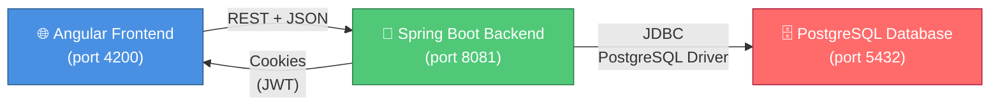
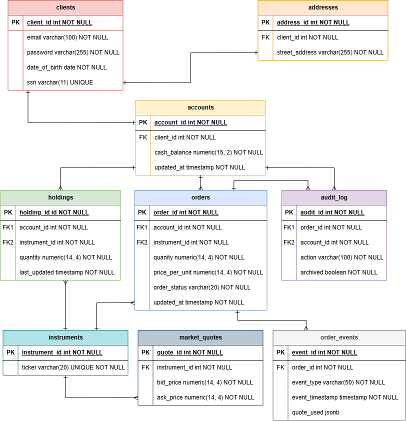
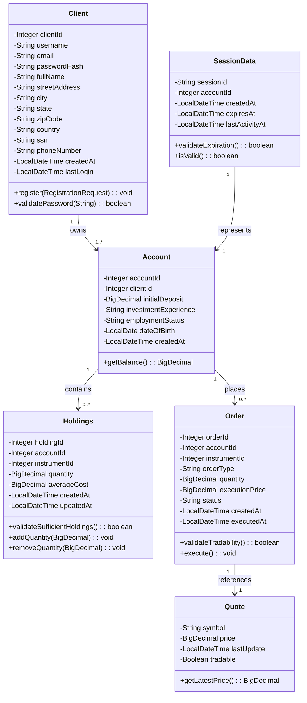
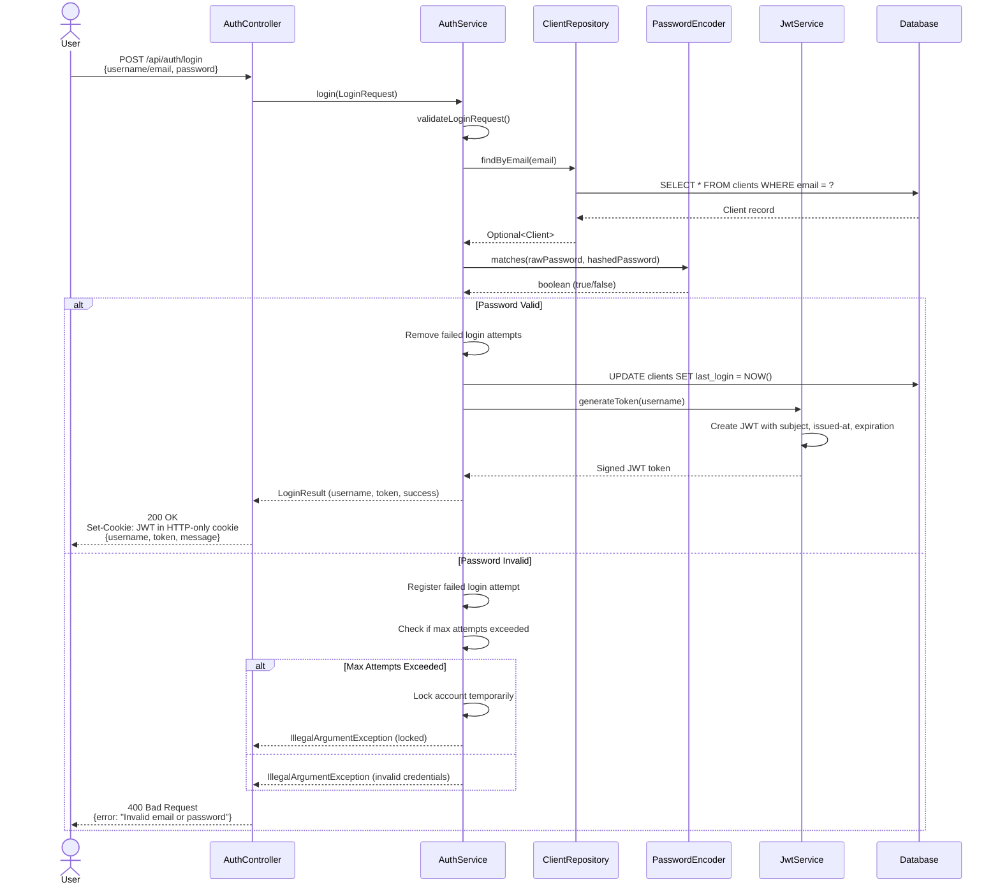
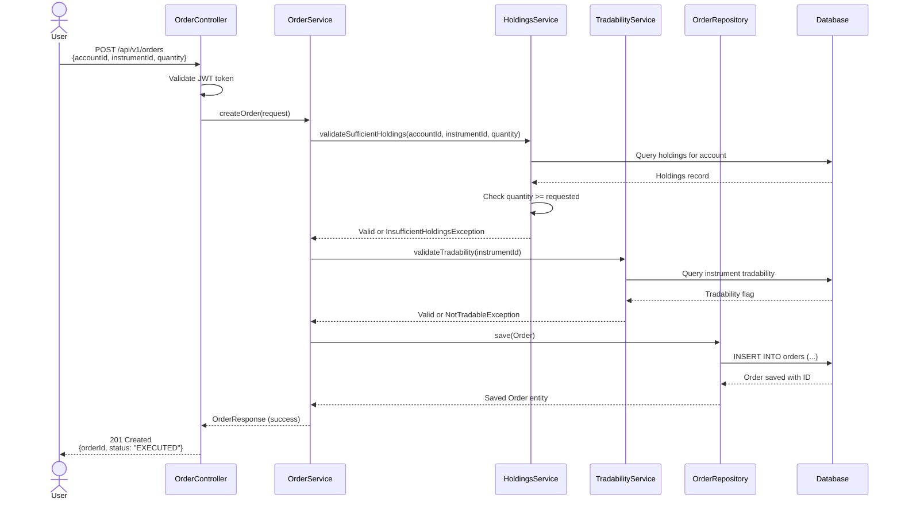

# LeMarketJames

A full-stack web application built with **Spring Boot 3** (Java 21) backend, **Angular 22** frontend, and **PostgreSQL 16** database. Includes Docker and Docker Compose support for containerized deployment.

## 🔗 Important Documents for Developers

**Before writing any code, read these:**

- **[API-CONTRACTS.md](API-CONTRACTS.md)** — The single source of truth for all API endpoints, request/response formats, and team agreements. Ensures all 6 developers can work in parallel without blocking.
- **[AGENTS.md](AGENTS.md)** — Project conventions, package structure, and **API Contract implementation guidelines** for backend (Spring Boot) and frontend (Angular).

**TL;DR:** Check [AGENTS.md](AGENTS.md) for how to implement against `/API-CONTRACTS.md` and you can build features independently without waiting on anyone else.

---

## Table of Contents

1. [Project Structure](#project-structure)
2. [Architecture](#architecture)
   - [System Topology](#system-topology)
   - [Authentication Flow](#authentication-flow)
   - [Technology Stack](#technology-stack)
   - [Current Features & Endpoints](#current-features--endpoints)
   - [Design Principles](#design-principles)
3. [Prerequisites](#prerequisites)
4. [Running the Application](#running-the-application)
   - [Method 1: Local Development (Maven + npm)](#method-1-local-development-maven--npm)
   - [Method 2: Docker Build & Run](#method-2-docker-build--run)
   - [Method 3: Docker Compose (Full Stack with Database)](#method-3-docker-compose-full-stack-with-database)
   - [Market simulation settings](#market-simulation-settings)
5. [Testing](#testing)
   - [Backend Tests (Java/JUnit)](#backend-tests-javajunit)
   - [Frontend Tests (TypeScript/Vitest)](#frontend-tests-typescriptvitest)
6. [API & Frontend Access](#api--frontend-access)
7. [Troubleshooting](#troubleshooting)
   - [Port Already in Use](#port-already-in-use)
   - [Java Version Mismatch](#java-version-mismatch)
   - [Maven Build Fails](#maven-build-fails)
   - [npm Install Fails](#npm-install-fails)
   - [Database Connection Refused](#database-connection-refused-docker-compose-or-local-dev)
   - [Quote Prices Are Not Changing](#quote-prices-are-not-changing)
   - [Container Exits Immediately](#container-exits-immediately-docker)
8. [CI/CD Pipeline](#cicd-pipeline)
9. [Javadocs](#javadocs)
10. [ER Diagram](#er-diagram)
11. [UML Diagrams](#uml-diagrams)
    - [Class Diagram: Backend Data Model](#class-diagram-backend-data-model)
    - [Sequence Diagram: Backend Login Flow](#sequence-diagram-backend-login-flow)
    - [Sequence Diagram: Backend Order Creation Flow](#sequence-diagram-backend-order-creation-flow)
12. [Code Coverage](#code-coverage)

---

## Project Structure

See [AGENTS.md](AGENTS.md) for the full conventions doc (package/folder rules, build & test commands). Summary:

```
LeMarketJames/
├── apps/
│   ├── backend/                   # Java/Spring Boot backend (feature-based packages)
│   │   ├── src/main/java/com/lemarketjames/
│   │   │   ├── auth/              # Authentication & security feature
│   │   │   ├── common/            # Shared code (exceptions, utilities)
│   │   │   ├── config/            # Cross-cutting config (Security, etc.)
│   │   │   └── [other features]/  # Feature packages: market, orders, holdings, quotes, etc.
│   │   ├── src/test/java/        # JUnit tests (mirrors main layout)
│   │   ├── pom.xml               # Maven configuration
│   │   └── Dockerfile            # Backend container image
│   └── frontend/                  # Angular 22 frontend
│       ├── src/app/
│       │   ├── core/             # App-wide singletons: auth, interceptors
│       │   ├── shared/           # Reusable components and models
│       │   ├── features/         # Feature modules: auth, dashboard, etc.
│       │   └── [other files]/    # Routing, styles, environment configs
│       ├── package.json          # npm dependencies
│       └── Dockerfile            # Frontend container image
├── database/schema/              # Numbered SQL files (001_, 002_, etc.)
├── docker-compose.yml            # Full-stack orchestration
├── Jenkinsfile                   # CI/CD pipeline
├── AGENTS.md                     # Conventions for developers
├── API-CONTRACTS.md              # Endpoint & data contracts
└── README.md                     # This file
```

## Architecture

This section describes the current system architecture. As new features are added, this will be updated to reflect changes.

### System Topology

LeMarketJames is a **3-tier distributed architecture** with three independent services communicating over HTTP:



**Key Characteristics:**
- **Stateless backend:** No session state; authentication via JWT tokens
- **Unidirectional data flow:** Browser → Backend → Database (only backend talks to database)
- **Containerized:** Each service can run independently or together via Docker Compose
- **Separation of concerns:** Frontend handles UI/UX; backend handles business logic and security; database stores persistent state

### Authentication Flow

The application implements **JWT (JSON Web Token) based authentication** with HTTP-only cookies:

1. **Registration:** User submits credentials and profile info to `/api/auth/register`
   - Backend validates input, hashes password with BCrypt, stores user in database
   - Returns success/error response

2. **Login:** User submits username/password to `/api/auth/login`
   - Backend verifies credentials, generates JWT token
   - Returns JWT token in an HTTP-only, secure cookie
   - Token includes username as subject, issued-at time, and expiration time

3. **Authenticated Requests:** Subsequent requests include JWT cookie automatically
   - `JwtAuthenticationFilter` extracts token from cookie
   - `JwtService` validates token signature and expiration
   - If valid, request is authenticated; invalid tokens return 401 Unauthorized

4. **Logout:** Clears the JWT cookie on the client side

### Technology Stack

| Layer | Technology | Purpose | Version |
|-------|-----------|---------|---------|
| **Frontend** | Angular | Reactive UI framework | 22 |
| | Angular Material | Design system and component library | 22 |
| | TypeScript | Type-safe JavaScript | Latest |
| | Zod | Schema validation (client-side) | Latest |
| **Backend** | Spring Boot | Web framework and server | 3 |
| | Spring Security | Authentication and authorization | 6 |
| | JWT (io.jsonwebtoken) | Token generation and validation | Latest |
| | Maven | Dependency management and build | 3.9.9+ |
| | JUnit 5 | Unit and integration testing | 5 |
| **Database** | PostgreSQL | Relational database | 16 |
| | Raw SQL | Schema definition (no migration tool) | SQL |
| **Deployment** | Docker | Container runtime | Latest |
| | Docker Compose | Multi-container orchestration | v2+ |

### Current Features & Endpoints

**See [API-CONTRACTS.md](API-CONTRACTS.md) for the complete and current list of all endpoints, request/response formats, and contracts.**

**Key Features:**
- **Authentication:** User registration, login, JWT-based stateless sessions with HTTP-only cookies
- **Market Simulation:** Live price ticks using Geometric Brownian Motion (GBM); configurable per-instrument drift and volatility; designed for testing orders and holdings at realistic prices
- **Holdings & Orders:** Track stock positions and execute buy/sell orders with tradability and holdings validation
- **Quotes:** Real-time stock quotes from the simulated market

**Architecture Notes:**
- Feature-based organization: `auth/`, `market/`, `holdings/`, `orders/`, `quotes/`, `sessions/` packages
- Layered pattern: Controllers → Services → Repositories; DTOs for API contracts
- Data persisted in PostgreSQL; market prices and session state in-memory
- Full design and tuning details: **[docs/MARKET.md](docs/MARKET.md)**, **[docs/BACKEND.md](docs/BACKEND.md)**

### Design Principles

- **Feature-based organization:** Code organized by business capability (e.g., `auth/` package contains all auth-related classes)
- **Separation of layers:** Controllers handle HTTP; services handle business logic; DTOs transfer data
- **Security first:** Passwords hashed with BCrypt; JWT tokens signed; HTTP-only cookies prevent XSS attacks
- **Scalability:** Stateless backend allows horizontal scaling; database can be scaled independently

---

## Prerequisites

Before running the application, ensure you have the following installed:

| Component | Version | Command to Verify |
|-----------|---------|-------------------|
| Java | 21 | `java -version` |
| Maven | 3.9.9 or higher | `mvn -version` |
| Node.js | 11.16.0 or higher | `node -version` |
| npm | 11.16.0 or higher | `npm -version` |
| Docker | required (runs PostgreSQL locally; also used for containerized deployment) | `docker --version` |
| Docker Compose | v2+ | `docker compose version` |
| psql / a Postgres client | to apply `database/schema/*.sql` | `psql --version` |

**PostgreSQL is required even for local (non-Docker) backend development.** The backend persists to Postgres via JPA and fails to start without a reachable database — there is no in-memory fallback.

## Running the Application

Choose one of the three methods below based on your use case:

### Method 1: Local Development (Maven + npm)

This is the recommended approach for active development, as it provides hot-reload for both backend and frontend.

**Database Setup (required before starting the backend):**

1. Start just the `db` service (Postgres 16) in the background:
   ```bash
   docker compose up -d db
   ```

2. Apply the schema files **in numeric order** (only needed once, or after `docker compose down -v`):
   ```bash
   psql -h localhost -U lemarket -d lemarket -f database/schema/001_core_schema.sql
   psql -h localhost -U lemarket -d lemarket -f database/schema/002_add_email_unique.sql
   psql -h localhost -U lemarket -d lemarket -f database/schema/003_add_experience.sql
   psql -h localhost -U lemarket -d lemarket -f database/schema/004_widen_ssn_for_hash.sql
   psql -h localhost -U lemarket -d lemarket -f database/schema/005_set_googl_non_tradable.sql
   psql -h localhost -U lemarket -d lemarket -f database/schema/006_market_simulation.sql
   ```
   Default password is `changeme` (see `docker-compose.yml`). Schema changes always land in new numbered files — never edit `001_...`/`002_...` in place.

**Backend Setup (Spring Boot on port 8081):**

1. Navigate to the backend project:
   ```bash
   cd apps/backend
   ```

2. Install Java dependencies with Maven:
   ```bash
   mvn clean install
   ```

3. Start the Spring Boot application:
   ```bash
   mvn spring-boot:run
   ```
   The backend will be available at `http://localhost:8081`. It connects to `jdbc:postgresql://localhost:5432/lemarket` by default (see `apps/backend/src/main/resources/application.properties`); override with the `SPRING_DATASOURCE_URL`/`SPRING_DATASOURCE_USERNAME`/`SPRING_DATASOURCE_PASSWORD` env vars if needed.

4. Confirm the backend can reach the database:
   ```bash
   curl http://localhost:8081/actuator/health
   ```
   Expect `{"status":"UP"}`. `{"status":"DOWN"}` usually means the `db` container isn't running or the schema hasn't been applied yet.

**Frontend Setup (Angular on port 4200):**

1. Navigate to the frontend directory:
   ```bash
   cd apps/frontend
   ```

2. Install frontend dependencies:
   ```bash
   npm install
   ```

3. Start the Angular development server:
   ```bash
   npm start
   ```
   The frontend will be available at `http://localhost:4200`

4. Access the application:
   - **Registration Form:** `http://localhost:4200/register`
   - **Login:** `http://localhost:4200/login`
   - **Home:** `http://localhost:4200`

**Frontend Features:**
- **Material Design UI:** Built with Angular Material 22 for professional appearance
- **Registration Form:** Comprehensive registration with validation
  - Personal Information (first name, middle name, last name)
  - Address (street, city, state dropdown, ZIP)
  - Identity (SSN, date of birth with date picker)
  - Financial (initial deposit, investment experience level)
  - Contact (email, phone with auto-formatting)
  - Security (password with show/hide toggle)
  - All fields have real-time validation with Material error messages
- **State-based Management:** Using Angular signals for reactive state updates
- **Responsive Design:** Mobile, tablet, and desktop layouts

**Note:** The frontend itself has no database dependency. But to exercise registration/login end-to-end, the backend must be running on `http://localhost:8081` *and* connected to a schema-initialized Postgres instance (see Database Setup above).

---

### Method 2: Docker Build & Run

This method builds a single Docker image and runs the application in a container.

1. Build the Docker image:
   ```bash
   docker build -t le-market-james:latest apps/backend
   ```

2. Run the container:
   ```bash
   docker run -p 8081:8081 --rm le-market-james
   ```
   The application will be available at `http://localhost:8081`

3. To stop the container, press `Ctrl+C` in the terminal.

**Note:** This method does not include the PostgreSQL database. The application will start but may have limited functionality. To use the database, see Method 3.

---

### Method 3: Docker Compose (Full Stack with Database)

This method spins up the complete stack: Angular frontend + Spring Boot backend + PostgreSQL database.

1. Start all services:
   ```bash
   docker compose up -d --build
   ```
   - Angular frontend: `http://localhost:4200`
   - Spring Boot backend: `http://localhost:8081`
   - PostgreSQL database: `localhost:5432`

2. Apply the schema (schema application is manual, not automated — see `database/README.md`):
   ```bash
   psql -h localhost -U lemarket -d lemarket -f database/schema/001_core_schema.sql
   psql -h localhost -U lemarket -d lemarket -f database/schema/002_add_email_unique.sql
   psql -h localhost -U lemarket -d lemarket -f database/schema/003_add_experience.sql
   psql -h localhost -U lemarket -d lemarket -f database/schema/004_widen_ssn_for_hash.sql
   psql -h localhost -U lemarket -d lemarket -f database/schema/005_set_googl_non_tradable.sql
   psql -h localhost -U lemarket -d lemarket -f database/schema/006_market_simulation.sql
   ```

3. Confirm the backend is up and connected to the database:
   ```bash
   curl http://localhost:8081/actuator/health
   ```

4. View logs:
   ```bash
   docker compose logs -f backend
   ```

5. Stop all services:
   ```bash
   docker compose down
   ```

**Database Credentials:**
- Username: `lemarket`
- Password: `changeme` (default; override with environment variable)

To use a custom database password, set the `DB_PASSWORD` environment variable:
```bash
DB_PASSWORD=your_secure_password docker compose up -d --build
```

**Database Port:** PostgreSQL is exposed on `localhost:5432` for use with database tools (e.g., pgAdmin, DBeaver).

### Market simulation settings

The simulated market is configured in `apps/backend/src/main/resources/application.properties`.
Each setting can be overridden with an environment variable:

| Property | Env variable | Default | Purpose |
|---|---|---|---|
| `sim.enabled` | `SIM_ENABLED` | `true` | Whether prices tick automatically |
| `sim.tick-ms` | `SIM_TICK_MS` | `1000` | Milliseconds between price ticks |
| `sim.seed` | `SIM_SEED` | *(empty)* | Fixed random seed to replay the same market |
| `sim.speed-multiplier` | `SIM_SPEED_MULTIPLIER` | `1` | Simulated seconds per real second; raise for faster-moving demos |
| `sim.snapshot-interval-ms` | `SIM_SNAPSHOT_INTERVAL_MS` | `5000` | How often latest prices and candles are saved |
| `sim.respect-market-hours` | `SIM_RESPECT_MARKET_HOURS` | `true` | Only move prices while each exchange is open |

Per-instrument behaviour (drift, volatility, spread, etc.) lives in the `instrument_market_params`
table — see [database/README.md](database/README.md#tuning-the-market).

---

## Testing

### Backend Tests (Java/JUnit)

Run all JUnit tests:

```bash
cd apps/backend
mvn test
```

Test results are generated in `apps/backend/target/surefire-reports/`. Successful tests confirm the Spring Boot application and authentication logic are functioning correctly.

### Frontend Tests (TypeScript/Vitest)

Run all frontend tests:

```bash
cd apps/frontend
npm test
```

---

## API & Frontend Access

Once the application is running (via any of the three methods), you can access:

| Service | URL | Purpose |
|---------|-----|---------|
| **Angular Frontend** | `http://localhost:4200` | User interface (when using Method 1) |
| **Registration Page** | `http://localhost:4200/register` | User registration with Material Design form |
| **Spring Boot Backend** | `http://localhost:8081` | REST API endpoints |
| **Auth Register API** | `POST http://localhost:8081/api/auth/register` | Register new user |
| **Auth Login API** | `POST http://localhost:8081/api/auth/login` | User login |
| **Health Check** | `GET http://localhost:8081/actuator/health` | Backend + DB liveness (`UP`/`DOWN`) |
| **PostgreSQL Database** | `localhost:5432` | Database server |

**Frontend Routes:**
- `/register` - User registration page with comprehensive form
- `/login` - User login

See [apps/backend/src/main/java/com/lemarketjames/auth/AuthController.java](apps/backend/src/main/java/com/lemarketjames/auth/AuthController.java) for complete API endpoint definitions.

**Form Validation:**
All form validation is performed client-side using Zod schema validation before submission to the backend. See [apps/frontend/src/app/features/auth/register/register.schema.ts](apps/frontend/src/app/features/auth/register/register.schema.ts) for validation rules.

---

## Troubleshooting

### Port Already in Use

If you see an error like "Address already in use" or "Port X is already allocated":

- **Port 8081 (Spring Boot):** Check if another service is using it:
  ```bash
  netstat -ano | findstr :8081
  ```
  Kill the process or choose a different port in `apps/backend/src/main/resources/application.properties`.

- **Port 4200 (Angular):** Start the dev server on a different port:
  ```bash
  ng serve --port 4300
  ```

- **Port 5432 (PostgreSQL):** Choose a different port in `docker-compose.yml` or stop other PostgreSQL instances.

### Java Version Mismatch

The application requires **Java 21**. If you have multiple Java versions installed:

```bash
java -version
```

If this shows Java 11 or 17, update your `JAVA_HOME` environment variable to point to Java 21:
```bash
# Windows
setx JAVA_HOME "C:\Program Files\Java\jdk-21"
```

Then restart your terminal and verify:
```bash
java -version
```

### Maven Build Fails

- Clear Maven cache and rebuild:
  ```bash
  cd apps/backend
  mvn clean install
  ```

- Ensure you're in `apps/backend` (where `pom.xml` is located).

### npm Install Fails

- Use the npm ci (clean install) command for reproducible builds:
  ```bash
  cd apps/frontend
  npm ci
  ```

- Clear npm cache:
  ```bash
  npm cache clean --force
  ```

### Database Connection Refused (Docker Compose or Local Dev)

- Check `GET http://localhost:8081/actuator/health` first — `{"status":"DOWN"}` means the backend can't reach Postgres.

- Verify all services are running (Docker Compose):
  ```bash
  docker compose ps
  ```

- For local dev (Method 1), confirm the `db` container is up:
  ```bash
  docker compose up -d db
  docker compose logs db
  ```

- Confirm the schema was applied — `spring.jpa.hibernate.ddl-auto=validate` means the backend refuses to start if expected tables/columns are missing:
  ```bash
  psql -h localhost -U paysprint -d paysprint -c "\dt"
  ```
  If tables are missing, re-run the `psql -f database/schema/...sql` commands from the Database Setup section, in order.

- Ensure PostgreSQL has time to start (it may take 10-15 seconds):
  ```bash
  docker compose logs backend | grep "Hibernate" | head -1
  ```

- Rebuild from scratch:
  ```bash
  docker compose down -v
  docker compose up -d --build
  ```

### Quote Prices Are Not Changing

- US equities only move during market hours: 09:30–16:00 New York time, Monday–Friday. Outside those hours quotes show the last price. To see prices move anyway during development, start the backend with `SIM_RESPECT_MARKET_HOURS=false`.
- Check that `sim.enabled` is not set to `false`.
- If every quote returns 404 and the backend log says `No instruments have market simulation parameters`, apply `database/schema/006_market_simulation.sql` (see [database/README.md](database/README.md#006--market-simulation)).

### Container Exits Immediately (Docker)

Check the logs:
```bash
docker logs le-market-james
```

Common causes:
- Java 21 not available in the container (check Dockerfile `FROM` base image)
- Database not running when the app expects it (use Docker Compose, not standalone `docker run`)
- Missing `application.properties` configuration

---

## CI/CD Pipeline

This repository includes a **Jenkins Pipeline** (`Jenkinsfile`) that:

1. Runs Maven tests (`mvn test`)
2. Builds the Docker image
3. Runs the containerized application
4. Verifies the output
5. Cleans up resources

The Jenkins agent requires:
- Java 21
- Maven 3.9.9+
- Docker daemon
- Permission to run Docker commands

To set up the pipeline, create a **Pipeline job** in Jenkins and point it to this repository with "Pipeline script from SCM" selected.

## Javadocs

Viewable at the following link:

https://aditya0774.github.io/LeMarketJames/

## ER Diagram



---

## UML Diagrams

### Class Diagram: Backend Data Model

This diagram shows the core data model and relationships between entities in the backend:



---

### Sequence Diagram: Backend Login Flow

This diagram shows the authentication sequence when a user logs in:



---

### Sequence Diagram: Backend Order Creation Flow

This diagram shows the sequence of interactions within the Spring Boot backend when a user creates a trading order:



## Code Coverage

To generate a code coverage report, run the following commands in your terminal:

```bash
cd apps/backend
mvn clean test jacoco:report
```

Then, open the report in your browser using one of the following commands in your terminal, depending on your OS:

Windows:
```bash
start target/site/jacoco/index.html
```

macOS:
```bash
open target/site/jacoco/index.html
```

Linux:
```bash
xdg-open target/site/jacoco/index.html
```
