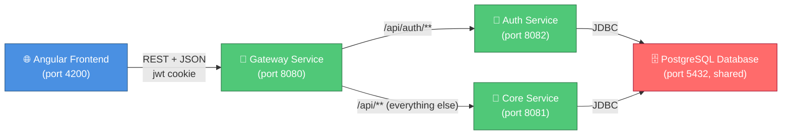
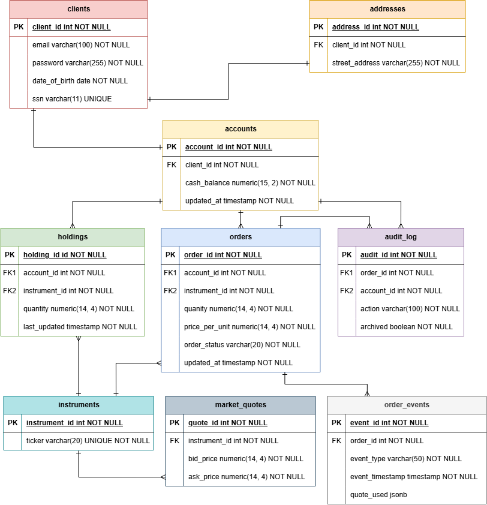
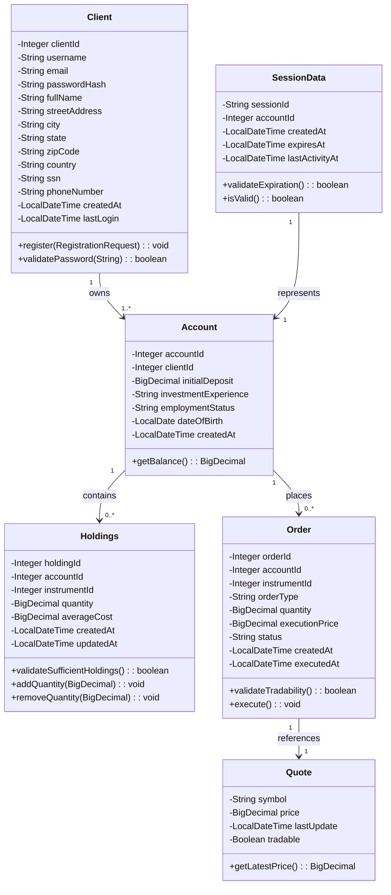
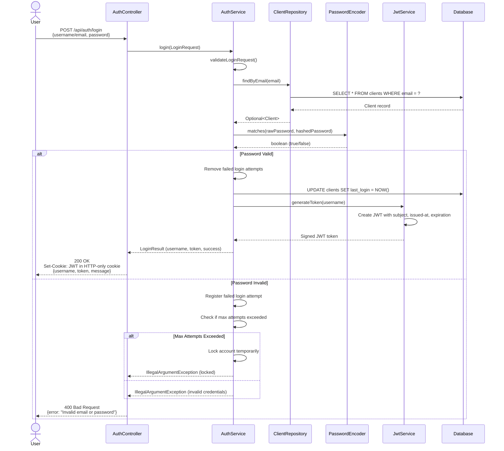
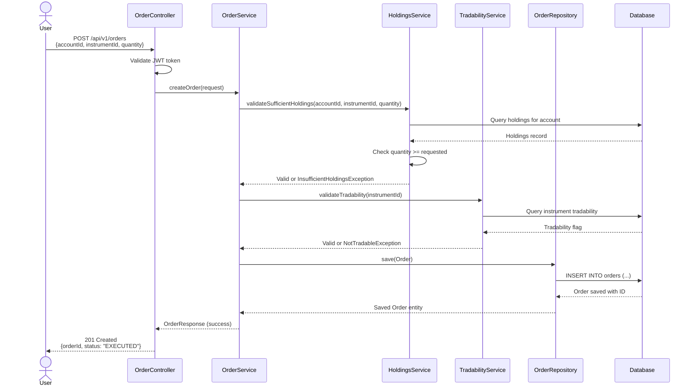

# LeMarketJames

A full-stack web application built with **Spring Boot 3** (Java 21) backend, **Angular 22** frontend, and **PostgreSQL 16** database. Includes Docker and Docker Compose support for containerized deployment.

## 🔗 Important Documents for Developers

**Before writing any code, read these:**

- **[contracts/](contracts/README.md)**: The shared contracts (C1–C7) every feature codes against: order lifecycle, audit format, seed data and test logins, quote-feed controls, settings, API endpoints and events, and roles. These are what let the team work in parallel without blocking each other.
- **[AGENTS.md](AGENTS.md)**: Project conventions and package structure for backend (Spring Boot) and frontend (Angular).

**TL;DR:** Read the contract your change touches in [contracts/](contracts/README.md), follow [AGENTS.md](AGENTS.md), and you can build features independently without waiting on anyone else. Test logins for every kind of user are in [C3 seed data](contracts/C3-seed-data.md).

---

## Table of Contents

1. [Project Structure](#project-structure)
2. [Architecture](#architecture)
   - [System Topology](#system-topology)
   - [Authentication Flow](#authentication-flow)
   - [Technology Stack](#technology-stack)
   - [Current Features & Endpoints](#current-features--endpoints)
   - [Design Principles](#design-principles)
3. [Prerequisites](#prerequisites)
4. [Running the Application](#running-the-application)
   - [Method 1: Local Development (Maven + npm)](#method-1-local-development-maven--npm)
   - [Method 2: Docker Build & Run](#method-2-docker-build--run)
   - [Method 3: Docker Compose (Full Stack with Database)](#method-3-docker-compose-full-stack-with-database)
   - [Market simulation settings](#market-simulation-settings)
5. [Testing](#testing)
   - [Backend Tests (Java/JUnit)](#backend-tests-javajunit)
   - [Frontend Tests (TypeScript/Vitest)](#frontend-tests-typescriptvitest)
6. [API & Frontend Access](#api--frontend-access)
7. [Troubleshooting](#troubleshooting)
   - [Port Already in Use](#port-already-in-use)
   - [Java Version Mismatch](#java-version-mismatch)
   - [Maven Build Fails](#maven-build-fails)
   - [npm Install Fails](#npm-install-fails)
   - [Database Connection Refused](#database-connection-refused-docker-compose-or-local-dev)
   - [Quote Prices Are Not Changing](#quote-prices-are-not-changing)
   - [Container Exits Immediately](#container-exits-immediately-docker)
8. [CI/CD Pipeline](#cicd-pipeline)
9. [Javadocs](#javadocs)
10. [ER Diagram](#er-diagram)
11. [UML Diagrams](#uml-diagrams)
    - [Class Diagram: Backend Data Model](#class-diagram-backend-data-model)
    - [Sequence Diagram: Backend Login Flow](#sequence-diagram-backend-login-flow)
    - [Sequence Diagram: Backend Order Creation Flow](#sequence-diagram-backend-order-creation-flow)
12. [Code Coverage](#code-coverage)

---

## Project Structure

See [AGENTS.md](AGENTS.md) for the full conventions doc (package/folder rules, build & test commands). Summary:

```
LeMarketJames/
├── pom.xml                        # Parent pom: lists every backend module, shared versions/plugins
├── libs/
│   └── common/                    # Shared jar: JWT security, account entities, error handling
├── services/                      # Spring Boot microservices (each has its own pom.xml + Dockerfile)
│   ├── gateway-service/           # :8080 Spring Cloud Gateway, the only backend entry point
│   ├── auth-service/              # :8082 register, login, logout, /api/auth/me
│   └── core-service/              # :8081 holdings, market, orders, quotes, sessions
│       ├── src/main/java/com/lemarketjames/
│       │   ├── common/            # Core-specific exception handler
│       │   ├── config/            # Cross-cutting config (Security, etc.)
│       │   └── [features]/        # market, orders, holdings, quotes, sessions
│       └── src/test/java/         # JUnit tests (mirrors main layout)
├── apps/
│   └── frontend/                  # Angular 22 frontend
│       ├── src/app/
│       │   ├── core/             # App-wide singletons: auth, interceptors
│       │   ├── shared/           # Reusable components and models
│       │   ├── features/         # Feature modules: auth, dashboard, etc.
│       │   └── [other files]/    # Routing, styles, environment configs
│       ├── package.json          # npm dependencies
│       └── Dockerfile            # Frontend container image
├── database/schema/              # Numbered SQL files (001_, 002_, etc.)
├── docker-compose.yml            # Full-stack orchestration
├── Jenkinsfile                   # CI/CD pipeline
├── AGENTS.md                     # Conventions for developers
├── contracts/                    # Shared contracts C1–C7 (API, lifecycle, audit, seed data, ...)
└── README.md                     # This file
```

## Architecture

This section describes the current system architecture. As new features are added, this will be updated to reflect changes.

### System Topology

LeMarketJames is a **hybrid monorepo**: one repository holding an Angular frontend and several Spring Boot microservices, which all share one PostgreSQL database. Auth is the first extracted service. Features not yet extracted live together in `core-service`.


```mermaid
graph LR
    A["🌐 Angular Frontend<br/>(port 4200)"] -->|"REST + JSON<br/>jwt cookie"| G["🚪 Gateway Service<br/>(port 8080)"]
    G -->|"/api/auth/**"| AU["🔐 Auth Service<br/>(port 8082)"]
    G -->|"/api/** (everything else)"| CO["🔧 Core Service<br/>(port 8081)"]
    AU -->|"JDBC"| C["🗄️ PostgreSQL Database<br/>(port 5432, shared)"]
    CO -->|"JDBC"| C

    classDef frontend fill:#4A90E2,stroke:#2E5C8A,color:#fff
    classDef backend fill:#50C878,stroke:#2D7A4A,color:#fff
    classDef database fill:#FF6B6B,stroke:#A91D3A,color:#fff

    class A frontend
    class G,AU,CO backend
    class C database
```

**Key Characteristics:**
- **Stateless backend:** No session state; authentication via JWT tokens
- **Unidirectional data flow:** Browser → Gateway → Auth/Core service → Database (only services talk to the database)
- **Shared JWT secret:** auth-service issues the `jwt` cookie; every service validates it with the same `JWT_SECRET` (`libs/common`)
- **Containerized:** Each service can run independently or together via Docker Compose
- **Separation of concerns:** Frontend handles UI/UX; backend handles business logic and security; database stores persistent state

### Authentication Flow

The application implements **JWT (JSON Web Token) based authentication** with HTTP-only cookies:

1. **Registration:** User submits credentials and profile info to `/api/auth/register`
   - Backend validates input, hashes password with BCrypt, stores user in database
   - Returns success/error response

2. **Login:** User submits username/password to `/api/auth/login`
   - Backend verifies credentials, generates JWT token
   - Returns JWT token in an HTTP-only, secure cookie
   - Token includes username as subject, issued-at time, and expiration time

3. **Authenticated Requests:** Subsequent requests include JWT cookie automatically
   - `JwtAuthenticationFilter` extracts token from cookie
   - `JwtService` validates token signature and expiration
   - If valid, request is authenticated; invalid tokens return 401 Unauthorized

4. **Logout:** Clears the JWT cookie on the client side

### Technology Stack

| Layer | Technology | Purpose | Version |
|-------|-----------|---------|---------|
| **Frontend** | Angular | Reactive UI framework | 22 |
| | Angular Material | Design system and component library | 22 |
| | TypeScript | Type-safe JavaScript | Latest |
| | Zod | Schema validation (client-side) | Latest |
| **Backend** | Spring Boot | Web framework and server | 3 |
| | Spring Security | Authentication and authorization | 6 |
| | JWT (io.jsonwebtoken) | Token generation and validation | Latest |
| | Maven | Dependency management and build | 3.9.9+ |
| | JUnit 5 | Unit and integration testing | 5 |
| **Database** | PostgreSQL | Relational database | 16 |
| | Raw SQL | Schema definition (no migration tool) | SQL |
| **Deployment** | Docker | Container runtime | Latest |
| | Docker Compose | Multi-container orchestration | v2+ |

### Current Features & Endpoints

**See [contracts/C6-api.md](contracts/C6-api.md) for the complete and current list of all endpoints, request/response formats, and contracts.**

**Key Features:**
- **Authentication:** User registration, login, JWT-based stateless sessions with HTTP-only cookies
- **Market Simulation:** Live price ticks using Geometric Brownian Motion (GBM); configurable per-instrument drift and volatility; designed for testing orders and holdings at realistic prices
- **Holdings & Orders:** Track stock positions and execute buy/sell orders with tradability and holdings validation
- **Quotes:** Real-time stock quotes from the simulated market

**Architecture Notes:**
- Feature-based organization: `auth/`, `market/`, `holdings/`, `orders/`, `quotes/`, `sessions/` packages
- Layered pattern: Controllers → Services → Repositories; DTOs for API contracts
- Data persisted in PostgreSQL; market prices and session state in-memory
- Quote-feed design, settings and test controls: **[contracts/C4-quote-feed.md](contracts/C4-quote-feed.md)**

### Design Principles

- **Feature-based organization:** Code organized by business capability (e.g., `auth/` package contains all auth-related classes)
- **Separation of layers:** Controllers handle HTTP; services handle business logic; DTOs transfer data
- **Security first:** Passwords hashed with BCrypt; JWT tokens signed; HTTP-only cookies prevent XSS attacks
- **Scalability:** Stateless backend allows horizontal scaling; database can be scaled independently

---

## Prerequisites

Before running the application, ensure you have the following installed:

| Component | Version | Command to Verify |
|-----------|---------|-------------------|
| Java | 21 | `java -version` |
| Maven | 3.9.9 or higher | `mvn -version` |
| Node.js | 11.16.0 or higher | `node -version` |
| npm | 11.16.0 or higher | `npm -version` |
| Docker | required (runs PostgreSQL locally; also used for containerized deployment) | `docker --version` |
| Docker Compose | v2+ | `docker compose version` |
| psql / a Postgres client | to apply `database/schema/*.sql` | `psql --version` |

**PostgreSQL is required even for local (non-Docker) backend development.** The backend persists to Postgres via JPA and fails to start without a reachable database — there is no in-memory fallback.

## Running the Application

Choose one of the three methods below based on your use case. The team's current setup:
- **Windows development:** [Method 1](#method-1-local-development-maven--npm), with everything running natively. Windows Server and machines without virtualization can't run Docker's Linux containers.
- **Linux / Jenkins testing:** [Method 3](#method-3-docker-compose-full-stack-with-database), with the whole stack in Docker Compose.

Either way, everything runs on your own machine; nothing depends on a shared host.

### Method 1: Local Development (Maven + npm)

Runs the database, all five backend services, and the Angular dev server directly on your machine, with no Docker. This is the Windows setup, and it gives hot reload for the frontend.

**Prerequisites:** JDK 21 or newer, Maven 3.9+, Node.js, and PostgreSQL 16+ installed as a local service on port 5432. On Windows, use the EnterpriseDB installer and remember the `postgres` superuser password you choose.

**Database setup (once):**

On Windows, from the repo root:
```powershell
.\scripts\windows\setup-db.ps1
```
It asks for the `postgres` superuser password. It then creates the `lemarket` login and database, using the password `changeme` that every service expects by default, and applies every file in `database/schema/` in numeric order. Run it again with `-Reset` to wipe and recreate the database, for example after new schema files land. On other OSes, do the same by hand: create role and database `lemarket`, then `psql -U lemarket -d lemarket -f` each schema file in order. Schema changes always go in new numbered files; never edit existing ones in place.

**Start everything:**

On Windows, from the repo root:
```powershell
.\scripts\windows\start-all.ps1          # add -SkipBuild if the backend hasn't changed
```
It runs `mvn install -DskipTests` once, then opens one PowerShell window per process. Close a window to stop that process, or run `.\scripts\windows\stop-all.ps1` to stop them all (it also stops services started by hand on the usual ports). To do the same by hand, run each of these in its own terminal from the repo root, after `mvn install -DskipTests`:
```bash
mvn -pl services/market-service spring-boot:run     # http://localhost:8083
mvn -pl services/auth-service spring-boot:run       # http://localhost:8082
mvn -pl services/core-service spring-boot:run       # http://localhost:8081
mvn -pl services/holdings-service spring-boot:run   # http://localhost:8084
mvn -pl services/gateway-service spring-boot:run "-Dspring-boot.run.arguments=--server.port=8089"   # the frontend talks to this one
cd apps/frontend && npm install && npm start        # http://localhost:4200
```
The gateway runs on 8089, the same port Docker Compose publishes it on, because the frontend's [proxy.conf.json](apps/frontend/proxy.conf.json) forwards `/api/**` there. Every service's defaults (`src/main/resources/application.properties`) already point at `localhost`, so no environment variables are needed.

**Confirm it's up** (services take about 30 seconds):
```bash
curl http://localhost:8089/actuator/health
```
Expect `{"status":"UP"}`, then open `http://localhost:4200`. If you get `{"status":"DOWN"}` or a service fails at startup with a schema validation error, the database is usually missing or not fully migrated. Rerun `setup-db.ps1 -Reset`.

**Frontend Setup (Angular on port 4200):**

1. Navigate to the frontend directory:
   ```bash
   cd apps/frontend
   ```

2. Install frontend dependencies:
   ```bash
   npm install
   ```

3. Start the Angular development server:
   ```bash
   npm start
   ```
   The frontend will be available at `http://localhost:4200`

**Running the Frontend Against a Remote Backend (VM/Linux):**

If the backend is running on a remote machine (e.g., Linux VM, Docker Compose on `PRIVATE_IP:8089`), use the `start:vm` script instead:

```bash
cd apps/frontend
npm run start:vm
```

This uses [proxy.vm.json](apps/frontend/proxy.vm.json), which routes all `/api/**` calls to the remote backend instead of `localhost:8089`. Edit `proxy.vm.json` to change the backend host if needed:

```json
{
  "/api/**": {
    "target": "http://PRIVATE_IP:8089",
    "secure": false
  }
}
```

Replace `PRIVATE_IP` with your backend's IP or hostname. The frontend dev server will still run on your local machine (e.g., Windows), and your browser will proxy API calls to the remote backend.

4. Access the application:
   - **Registration Form:** `http://localhost:4200/register`
   - **Login:** `http://localhost:4200/login`
   - **Home:** `http://localhost:4200`

**Frontend Features:**
- **Material Design UI:** Built with Angular Material 22 for professional appearance
- **Registration Form:** Comprehensive registration with validation
  - Personal Information (first name, middle name, last name)
  - Address (street, city, state dropdown, ZIP)
  - Identity (SSN, date of birth with date picker)
  - Financial (initial deposit, investment experience level)
  - Contact (email, phone with auto-formatting)
  - Security (password with show/hide toggle)
  - All fields have real-time validation with Material error messages
- **State-based Management:** Using Angular signals for reactive state updates
- **Responsive Design:** Mobile, tablet, and desktop layouts

**Note:** The frontend itself has no database dependency. But to exercise registration/login end-to-end, all five backend services must be running (the dev proxy sends `/api` to the gateway on `http://localhost:8089`) *and* connected to a schema-initialized Postgres instance (see Database setup above).

---

### Method 2: Docker Build & Run

This method builds one service's Docker image and runs it in a container. Backend images build from the repo root so Maven can see the parent pom and `libs/common`.

1. Build the Docker image (swap `core-service` for `auth-service` or `gateway-service`):
   ```bash
   docker build -t lemarketjames/core-service:latest -f services/core-service/Dockerfile .
   ```

2. Run the container:
   ```bash
   docker run -p 8081:8081 --rm lemarketjames/core-service:latest
   ```
   The service will be available at `http://localhost:8081`

3. To stop the container, press `Ctrl+C` in the terminal.

**Note:** This method does not include the PostgreSQL database. The application will start but may have limited functionality. To use the database, see Method 3.

---

### Method 3: Docker Compose (Full Stack with Database)

This is the Linux/Jenkins setup. The frontend, backend, and database all run on one machine. It also works on Windows 10/11 with Docker Desktop, but not on Windows Server or on VMs without nested virtualization; use Method 1 there. Nothing points at a shared host.

**Full stack (Windows or Linux):**

1. From the repo root, build and start every service in the background:
   ```bash
   docker compose up -d --build
   ```
   (On older installs with Compose v1, the command is `docker-compose up -d --build`.)

   This starts:
   - Gateway (backend entry point): `http://localhost:8089` (container port 8080 is published on host port 8089)
   - Core service: `http://localhost:8081` (direct access for debugging)
   - Auth service: `http://localhost:8082` (direct access for debugging)
   - Market service: `http://localhost:8083` (direct access for debugging)
   - Holdings service: `http://localhost:8084` (direct access for debugging)
   - PostgreSQL database: `localhost:5432`
   - A production (nginx) build of the frontend: `http://localhost:4200`

2. The schema is applied automatically. On first start, Postgres runs every file in `database/schema/` in numeric order, because that folder is mounted into `docker-entrypoint-initdb.d`. This only happens when the `db_data` volume is empty. To pick up new schema files on an existing database, either apply them with `psql` (see [database/README.md](database/README.md)) or wipe and recreate the database:
   ```bash
   docker compose down -v
   docker compose up -d --build
   ```

3. Confirm the services are up and connected to the database:
   ```bash
   curl http://localhost:8089/actuator/health
   curl http://localhost:8081/actuator/health
   curl http://localhost:8082/actuator/health
   curl http://localhost:8083/actuator/health
   curl http://localhost:8084/actuator/health
   ```

4. Open `http://localhost:4200` and log in or register.

5. View logs:
   ```bash
   docker compose logs -f gateway-service auth-service core-service market-service holdings-service
   ```

6. Stop all services:
   ```bash
   docker compose down
   ```

**Hot-reload frontend (optional, for UI work):**

Run the backend in Docker and the Angular dev server on the same machine, so frontend edits reload instantly.

1. Start everything except the frontend container, which would otherwise hold port 4200. Starting the gateway also starts the services and database it depends on:
   ```bash
   docker compose stop frontend
   docker compose up -d --build gateway-service
   ```

2. Install dependencies (first time, or after `package.json` changes) and start the dev server:
   ```bash
   cd apps/frontend
   npm install
   npm start
   ```
   `npm start` uses [apps/frontend/proxy.conf.json](apps/frontend/proxy.conf.json), which forwards every `/api/**` request to the local gateway at `http://localhost:8089`.

3. Open `http://localhost:4200`.

**Opening a Linux/Jenkins host's stack from another machine:**

The gateway and services only accept browser API calls from the origin in `APP_CORS_ALLOWED_ORIGIN`, which defaults to `http://localhost:4200`. That default works whenever the browser runs on the same machine as the stack. To browse a Linux host's stack from your Windows machine at `http://<linux-host>:4200`, set that URL on the Linux host before starting Compose, either in an untracked `.env` file next to `docker-compose.yml` (Compose reads it automatically) or in the Jenkins agent's environment:
```bash
APP_CORS_ALLOWED_ORIGIN=http://<linux-host>:4200
```
This is per-machine configuration and is never committed, so the repo stays tied to no particular host.

**Database Credentials:**
- Username: `lemarket`
- Password: `changeme` (default; override with environment variable)

To use a custom database password, set the `DB_PASSWORD` environment variable:
```bash
DB_PASSWORD=your_secure_password docker compose up -d --build
```

**Database Port:** PostgreSQL is exposed on `localhost:5432` for use with database tools (e.g., pgAdmin, DBeaver).

### Market simulation settings

market-service simulates every stock's price. Its settings (tick rate, seed, speed, market hours, holidays) and the test controls, which can set a price or make the feed stale or unavailable, are described in [contracts/C4-quote-feed.md](contracts/C4-quote-feed.md). The business settings every service shares (lockout, staleness limit, ...) are in [contracts/C5-config.md](contracts/C5-config.md).

Per-instrument behaviour (drift, volatility, spread, etc.) lives in the `instrument_market_params`
table — see [database/README.md](database/README.md#tuning-the-market).

---

## Testing

### Backend Tests (Java/JUnit)

Run every module's JUnit tests from the repo root:

```bash
mvn test
```

Run just one service (plus the `libs/common` it depends on):

```bash
mvn -pl services/auth-service -am test
```

Test results are generated in each module's `target/surefire-reports/` (e.g. `services/core-service/target/surefire-reports/`).

### Frontend Tests (TypeScript/Vitest)

Run all frontend tests:

```bash
cd apps/frontend
npm test
```

### End-to-End Tests (Playwright)

[apps/e2e](apps/e2e) drives the running app in a real Chromium browser, the way a user does: registering, logging in and out, buying a stock, and filtering order history. The tests don't start the app. Run them against a disposable stack that is already up on `http://localhost:4200` (Method 1 or Method 3). Most tests register their own user; the order-history suite also inserts exact UTC boundary fixtures into that disposable stack and removes them afterward.

```bash
cd apps/e2e
npm install
npx playwright install chromium   # first time only: downloads the browser
npm test                          # or: npm run test:headed to watch the browser
npm run report                    # open the HTML report from the last run
```

To test a stack elsewhere, set `E2E_BASE_URL` (e.g. `E2E_BASE_URL=http://my-linux-host:4200`). The order-history suite also requires either `E2E_DATABASE_URL` or `E2E_ALLOW_DATABASE_SEED=true` with the standard `PGHOST`, `PGPORT`, `PGDATABASE`, `PGUSER`, and `PGPASSWORD` variables. Only enable database seeding for a disposable development or CI database; never point it at production.

Jenkins runs the suite in the stage **Run Playwright E2E tests**, right after the smoke test. It uses the official `mcr.microsoft.com/playwright` Docker image, so the agent needs only Docker. The image tag in the Jenkinsfile must match the `@playwright/test` version in `apps/e2e/package.json`; update both together. Results show on the build's test report. The HTML report, plus traces, screenshots and videos of any failed test, are archived as build artifacts.

---

## API & Frontend Access

Once the application is running (via any of the three methods), you can access:

| Service | URL | Purpose |
|---------|-----|---------|
| **Angular Frontend** | `http://localhost:4200` | User interface (dev server in Method 1, nginx container in Method 3) |
| **Registration Page** | `http://localhost:4200/register` | User registration with Material Design form |
| **API Gateway** | `http://localhost:8089` | Single entry point for all REST API endpoints (Methods 1 and 3) |
| **Auth Register API** | `POST http://localhost:8089/api/auth/register` | Register new user (routed to auth-service) |
| **Auth Login API** | `POST http://localhost:8089/api/auth/login` | User login (routed to auth-service) |
| **Health Checks** | `GET http://localhost:{8089,8081,8082,8083,8084}/actuator/health` | Gateway / core / auth / market / holdings liveness (`UP`/`DOWN`) |
| **PostgreSQL Database** | `localhost:5432` | Database server |

**Frontend Routes:**
- `/register` - User registration page with comprehensive form
- `/login` - User login

See [services/auth-service/src/main/java/com/lemarketjames/auth/AuthController.java](services/auth-service/src/main/java/com/lemarketjames/auth/AuthController.java) for the auth endpoint definitions and [contracts/C6-api.md](contracts/C6-api.md) for the rest.

**Form Validation:**
All form validation is performed client-side using Zod schema validation before submission to the backend. See [apps/frontend/src/app/features/auth/register/register.schema.ts](apps/frontend/src/app/features/auth/register/register.schema.ts) for validation rules.

---

## Troubleshooting

### Port Already in Use

If you see an error like "Address already in use" or "Port X is already allocated":

- **Ports 8080 / 8081 / 8082 (gateway / core / auth):** Check if another process is using one:
  ```bash
  netstat -ano | findstr :8081
  ```
  Kill the process or change `server.port` in that service's `src/main/resources/application.properties` (and update the gateway's `CORE_SERVICE_URL`/`AUTH_SERVICE_URL` to match).

- **Port 4200 (Angular):** Start the dev server on a different port:
  ```bash
  ng serve --port 4300
  ```

- **Port 5432 (PostgreSQL):** Choose a different port in `docker-compose.yml` or stop other PostgreSQL instances.

### Java Version Mismatch

The application requires **Java 21**. If you have multiple Java versions installed:

```bash
java -version
```

If this shows Java 11 or 17, update your `JAVA_HOME` environment variable to point to Java 21:
```bash
# Windows
setx JAVA_HOME "C:\Program Files\Java\jdk-21"
```

Then restart your terminal and verify:
```bash
java -version
```

### Maven Build Fails

- Clear Maven cache and rebuild from the repo root:
  ```bash
  mvn clean install
  ```

- Run Maven from the repo root (where the parent `pom.xml` is located). A single service can't resolve `libs/common` until it has been built, so use `-pl <module> -am` or run `mvn install` first.

### npm Install Fails

- Use the npm ci (clean install) command for reproducible builds:
  ```bash
  cd apps/frontend
  npm ci
  ```

- Clear npm cache:
  ```bash
  npm cache clean --force
  ```

### Database Connection Refused (Docker Compose or Local Dev)

- Check `GET http://localhost:8081/actuator/health` (core) and `GET http://localhost:8082/actuator/health` (auth) first. `{"status":"DOWN"}` means that service can't reach Postgres.

- Verify all services are running (Docker Compose):
  ```bash
  docker compose ps
  ```

- For local dev (Method 1), confirm the PostgreSQL service is running:
  ```powershell
  Get-Service postgresql*
  ```

- Confirm the schema was applied. Because of `spring.jpa.hibernate.ddl-auto=validate`, a service refuses to start if expected tables or columns are missing:
  ```bash
  psql -h localhost -U lemarket -d lemarket -c "\dt"
  ```
  If tables are missing, rerun `.\scripts\windows\setup-db.ps1 -Reset` (Method 1) or rebuild the Docker database (below).

- Ensure PostgreSQL has had time to start (Docker; it may take 10-15 seconds):
  ```bash
  docker compose logs db
  ```

- Rebuild from scratch:
  ```bash
  docker compose down -v
  docker compose up -d --build
  ```

### Quote Prices Are Not Changing

- US equities only move during market hours: 09:30–16:00 New York time, Monday–Friday. Outside those hours quotes show the last price. To see prices move anyway during development, start the backend with `SIM_RESPECT_MARKET_HOURS=false`.
- Check that `sim.enabled` is not set to `false`.
- If every quote returns 404 and the backend log says `No instruments have market simulation parameters`, apply `database/schema/006_market_simulation.sql` (see [database/README.md](database/README.md#006--market-simulation)).

### Container Exits Immediately (Docker)

Check the logs:
```bash
docker logs le-market-james
```

Common causes:
- Java 21 not available in the container (check Dockerfile `FROM` base image)
- Database not running when the app expects it (use Docker Compose, not standalone `docker run`)
- Missing `application.properties` configuration

---

## CI/CD Pipeline

This repository includes a **Jenkins Pipeline** (`Jenkinsfile`) that:

1. Runs Maven tests (`mvn test`)
2. Builds the Docker image
3. Runs the containerized application
4. Verifies the output
5. Cleans up resources

The Jenkins agent requires:
- Java 21
- Maven 3.9.9+
- Docker daemon
- Permission to run Docker commands

To set up the pipeline, create a **Pipeline job** in Jenkins and point it to this repository with "Pipeline script from SCM" selected.

## Javadocs

Viewable at the following link:

https://aditya0774.github.io/LeMarketJames/

## ER Diagram



---

## UML Diagrams

### Class Diagram: Backend Data Model

This diagram shows the core data model and relationships between entities in the backend:


```mermaid
classDiagram
    class Client {
        -Integer clientId
        -String username
        -String email
        -String passwordHash
        -String fullName
        -String streetAddress
        -String city
        -String state
        -String zipCode
        -String country
        -String ssn
        -String phoneNumber
        -LocalDateTime createdAt
        -LocalDateTime lastLogin
        +register(RegistrationRequest): void
        +validatePassword(String): boolean
    }

    class Account {
        -Integer accountId
        -Integer clientId
        -BigDecimal initialDeposit
        -String investmentExperience
        -String employmentStatus
        -LocalDate dateOfBirth
        -LocalDateTime createdAt
        +getBalance(): BigDecimal
    }

    class Holdings {
        -Integer holdingId
        -Integer accountId
        -Integer instrumentId
        -BigDecimal quantity
        -BigDecimal averageCost
        -LocalDateTime createdAt
        -LocalDateTime updatedAt
        +validateSufficientHoldings(): boolean
        +addQuantity(BigDecimal): void
        +removeQuantity(BigDecimal): void
    }

    class Order {
        -Integer orderId
        -Integer accountId
        -Integer instrumentId
        -String orderType
        -BigDecimal quantity
        -BigDecimal executionPrice
        -String status
        -LocalDateTime createdAt
        -LocalDateTime executedAt
        +validateTradability(): boolean
        +execute(): void
    }

    class Quote {
        -String symbol
        -BigDecimal price
        -LocalDateTime lastUpdate
        -Boolean tradable
        +getLatestPrice(): BigDecimal
    }

    class SessionData {
        -String sessionId
        -Integer accountId
        -LocalDateTime createdAt
        -LocalDateTime expiresAt
        -LocalDateTime lastActivityAt
        +validateExpiration(): boolean
        +isValid(): boolean
    }

    Client "1" --> "1..* " Account: owns
    Account "1" --> "0..*" Holdings: contains
    Account "1" --> "0..*" Order: places
    Order "1" --> "1" Quote: references
    SessionData "1" --> "1" Account: represents
```

---

### Sequence Diagram: Backend Login Flow

This diagram shows the authentication sequence when a user logs in:


```mermaid
sequenceDiagram
    actor User
    participant AuthController
    participant AuthService
    participant ClientRepository
    participant PasswordEncoder
    participant JwtService
    participant Database

    User->>AuthController: POST /api/auth/login<br/>{username/email, password}
    AuthController->>AuthService: login(LoginRequest)
    
    AuthService->>AuthService: validateLoginRequest()
    AuthService->>ClientRepository: findByEmail(email)
    ClientRepository->>Database: SELECT * FROM clients WHERE email = ?
    Database-->>ClientRepository: Client record
    ClientRepository-->>AuthService: Optional<Client>
    
    AuthService->>PasswordEncoder: matches(rawPassword, hashedPassword)
    PasswordEncoder-->>AuthService: boolean (true/false)
    
    alt Password Valid
        AuthService->>AuthService: Remove failed login attempts
        AuthService->>Database: UPDATE clients SET last_login = NOW()
        AuthService->>JwtService: generateToken(username)
        JwtService->>JwtService: Create JWT with subject, issued-at, expiration
        JwtService-->>AuthService: Signed JWT token
        AuthService-->>AuthController: LoginResult (username, token, success)
        AuthController-->>User: 200 OK<br/>Set-Cookie: JWT in HTTP-only cookie<br/>{username, token, message}
    else Password Invalid
        AuthService->>AuthService: Register failed login attempt
        AuthService->>AuthService: Check if max attempts exceeded
        alt Max Attempts Exceeded
            AuthService->>AuthService: Lock account temporarily
            AuthService-->>AuthController: IllegalArgumentException (locked)
        else
            AuthService-->>AuthController: IllegalArgumentException (invalid credentials)
        end
        AuthController-->>User: 400 Bad Request<br/>{error: "Invalid email or password"}
    end
```

---

### Sequence Diagram: Backend Order Creation Flow

This diagram shows the sequence of interactions within the Spring Boot backend when a user creates a trading order:


```mermaid
sequenceDiagram
    actor User
    participant OrderController
    participant OrderService
    participant HoldingsService
    participant TradabilityService
    participant OrderRepository
    participant Database

    User->>OrderController: POST /api/v1/orders<br/>{accountId, instrumentId, quantity}
    OrderController->>OrderController: Validate JWT token
    OrderController->>OrderService: createOrder(request)
    
    OrderService->>HoldingsService: validateSufficientHoldings(accountId, instrumentId, quantity)
    HoldingsService->>Database: Query holdings for account
    Database-->>HoldingsService: Holdings record
    HoldingsService->>HoldingsService: Check quantity >= requested
    HoldingsService-->>OrderService: Valid or InsufficientHoldingsException
    
    OrderService->>TradabilityService: validateTradability(instrumentId)
    TradabilityService->>Database: Query instrument tradability
    Database-->>TradabilityService: Tradability flag
    TradabilityService-->>OrderService: Valid or NotTradableException
    
    OrderService->>OrderRepository: save(Order)
    OrderRepository->>Database: INSERT INTO orders (...)
    Database-->>OrderRepository: Order saved with ID
    OrderRepository-->>OrderService: Saved Order entity
    
    OrderService-->>OrderController: OrderResponse (success)
    OrderController-->>User: 201 Created<br/>{orderId, status: "EXECUTED"}
```

## Java Code Coverage Using Jacoco

To generate a code coverage report, run the following commands in your terminal:

```bash
mvn clean test
```

Each module writes its own report (JaCoCo runs during `test`). Open one in your browser, e.g. core-service, using one of the following commands depending on your OS:

Windows:
```bash
start services/core-service/target/site/jacoco/index.html
```

macOS:
```bash
open services/core-service/target/site/jacoco/index.html
```

Linux:
```bash
xdg-open services/core-service/target/site/jacoco/index.html
```
