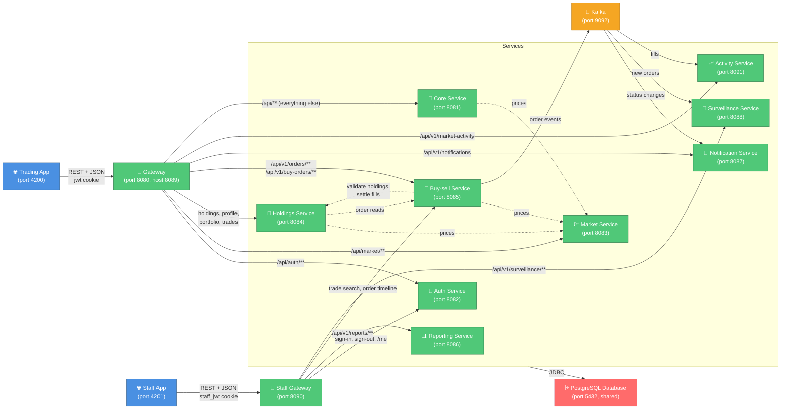
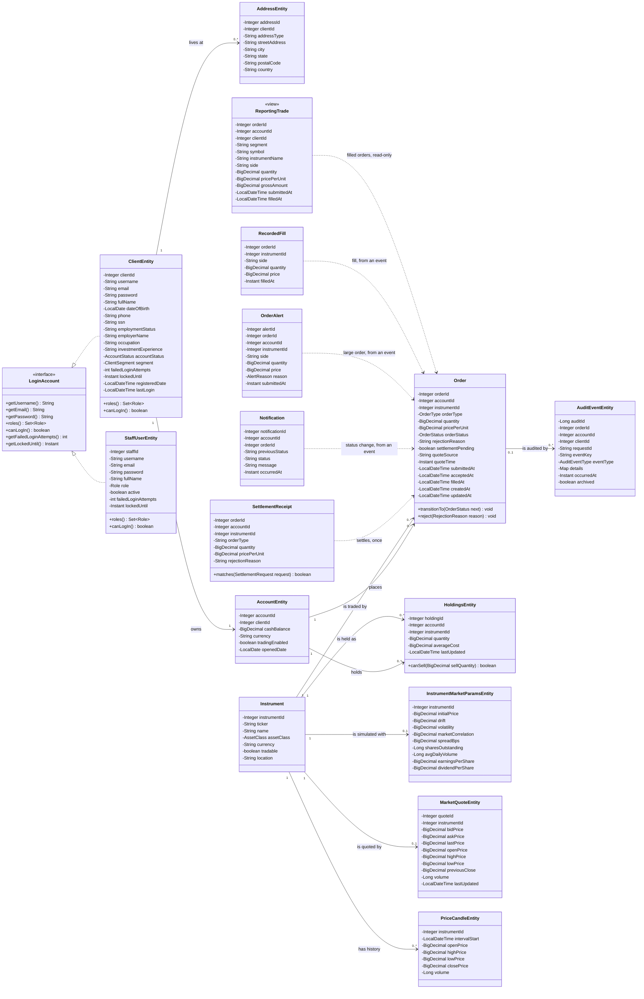
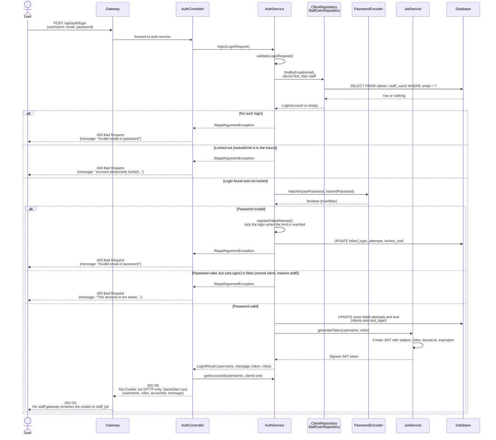
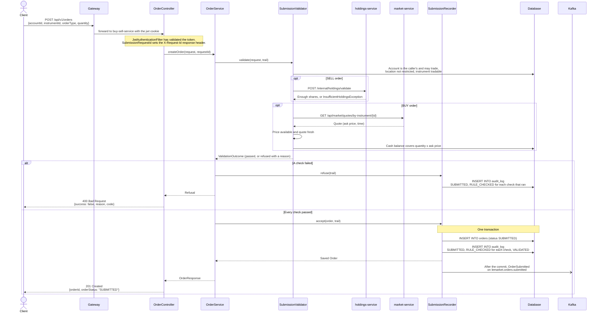
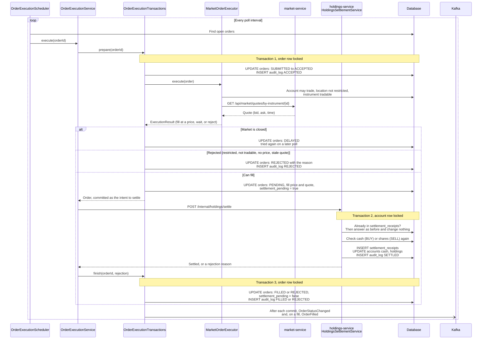

# LeMarketJames

A full-stack trading application: two **Angular 21** frontends (a trading app for clients and a staff app), **Spring Boot 3.5** microservices (Java 21) behind two gateways, one shared **PostgreSQL 16** database, and **Apache Kafka** for order events. Runs natively on Windows or in Docker Compose on Linux/Jenkins.

## 🔗 Important Documents for Developers

**Before writing any code, read these:**

- **[contracts/](contracts/README.md)**: The shared contracts (C1–C7) every feature codes against: order lifecycle, audit format, seed data and test logins, quote-feed controls, settings, API endpoints and events, and roles. These are what let the team work in parallel without blocking each other.
- **[AGENTS.md](AGENTS.md)**: Project conventions and package structure for backend (Spring Boot) and frontend (Angular).

**TL;DR:** Read the contract your change touches in [contracts/](contracts/README.md), follow [AGENTS.md](AGENTS.md), and you can build features independently without waiting on anyone else. Test logins for every kind of user are in [C3 seed data](contracts/C3-seed-data.md).

---

## Table of Contents

1. [Project Structure](#project-structure)
2. [Architecture](#architecture)
   - [System Topology](#system-topology)
   - [Authentication Flow](#authentication-flow)
   - [Technology Stack](#technology-stack)
   - [Current Features & Endpoints](#current-features--endpoints)
   - [Design Principles](#design-principles)
3. [Prerequisites](#prerequisites)
4. [Running the Application](#running-the-application)
   - [Method 1: Local Development (Maven + npm)](#method-1-local-development-maven--npm)
   - [Method 2: Docker Build & Run](#method-2-docker-build--run)
   - [Method 3: Docker Compose (Full Stack with Database)](#method-3-docker-compose-full-stack-with-database)
   - [Trading App and Staff App](#trading-app-and-staff-app)
   - [Market simulation settings](#market-simulation-settings)
   - [Kafka (order events)](#kafka-order-events)
5. [Testing](#testing)
   - [Backend Tests (Java/JUnit)](#backend-tests-javajunit)
   - [Frontend Tests (TypeScript/Vitest)](#frontend-tests-typescriptvitest)
   - [End-to-End Tests (Playwright)](#end-to-end-tests-playwright)
6. [API & Frontend Access](#api--frontend-access)
7. [Test Logins](#test-logins)
   - [Trading App Test Logins](#trading-app-test-logins-port-4200)
   - [Staff App Test Logins](#staff-app-test-logins-port-4201)
8. [Troubleshooting](#troubleshooting)
   - [Port Already in Use](#port-already-in-use)
   - [Java Version Mismatch](#java-version-mismatch)
   - [Maven Build Fails](#maven-build-fails)
   - [npm Install Fails](#npm-install-fails)
   - [Database Connection Refused](#database-connection-refused-docker-compose-or-local-dev)
   - [Quote Prices Are Not Changing](#quote-prices-are-not-changing)
   - [Container Exits Immediately](#container-exits-immediately-docker)
9. [CI/CD Pipeline](#cicd-pipeline)
   - [SonarQube](#sonarqube)
10. [Javadocs](#javadocs)
11. [ER Diagram](#er-diagram)
12. [UML Diagrams](#uml-diagrams)
    - [Class Diagram: Backend Data Model](#class-diagram-backend-data-model)
    - [Sequence Diagram: Backend Login Flow](#sequence-diagram-backend-login-flow)
    - [Sequence Diagram: Backend Order Submission Flow](#sequence-diagram-backend-order-submission-flow)
    - [Sequence Diagram: Backend Order Execution and Settlement Flow](#sequence-diagram-backend-order-execution-and-settlement-flow)
13. [Code Coverage](#code-coverage)
14. [Service Notes](#service-notes)
    - [Buy-sell service](#buy-sell-service)
    - [Reporting service](#reporting-service)

---

## Project Structure

See [AGENTS.md](AGENTS.md) for the full conventions doc (package/folder rules, build & test commands). Summary:

```
LeMarketJames/
├── pom.xml                        # Parent pom: lists every backend module, shared versions/plugins
├── libs/
│   ├── common/                    # Shared jar: JWT security, roles, account/instrument entities, audit recorder,
│   │                              #       order event topic names, settings, error handling
│   └── market-client/             # MarketDataService interface, its quote model, and the HTTP client for market-service
├── services/                      # Spring Boot microservices (each has its own pom.xml + Dockerfile)
│   ├── gateway-service/           # :8080 Spring Cloud Gateway, the trading app's only backend entry point
│   │                              #       (published on host port 8089); with the "staff" profile, :8090,
│   │                              #       the staff app's (the staff gateway)
│   ├── auth-service/              # :8082 register, login, logout, /api/auth/me (clients and staff)
│   ├── core-service/              # :8081 instruments, quotes, sessions; also the trading gateway's catch-all
│   ├── market-service/            # :8083 simulated price feed (GBM) and its test controls; server-to-server only
│   ├── holdings-service/          # :8084 profile, holdings, portfolio/balance, trade history; settles fills
│   ├── buy-sell-service/          # :8085 order placement, lifecycle, automatic execution, order events,
│   │                              #       trade search and order timeline for Trading Ops
│   ├── reporting-service/         # :8086 analyst reports (/api/v1/reports/**); behind the staff gateway only
│   ├── notification-service/      # :8087 Kafka consumer: tells clients what happened to their orders
│   ├── surveillance-service/      # :8088 Kafka consumer: alerts Trading Ops to large orders; staff gateway only
│   ├── activity-service/          # :8091 Kafka consumer: traded volume per stock
│   └── staff-gateway-service/     # Earlier stand-alone staff gateway. Maven still builds and tests it, but nothing
│                                  #       runs it: the staff gateway is gateway-service with the "staff" profile
├── apps/
│   ├── frontend/                  # Angular 21 workspace: both frontends
│   │   ├── src/app/               # Trading app (:4200)
│   │   │   ├── core/              # App-wide singletons: auth, interceptors, API clients
│   │   │   ├── shared/            # Reusable components, layout, models, pipes
│   │   │   └── features/          # auth, home, dashboard, holdings, orders, trade
│   │   ├── projects/staff/        # Staff app (:4201): a second Angular app in this workspace
│   │   ├── package.json           # npm dependencies (shared by both apps)
│   │   └── Dockerfile             # Trading app container image (the staff app's is in projects/staff/)
│   └── e2e/                       # Playwright end-to-end tests: tests/ (trading app), tests-staff/ (staff app)
├── contracts/                     # Shared contracts C1–C7 (API, lifecycle, audit, seed data, ...)
├── database/schema/               # Numbered SQL files (001_ … 018_); 011 is the seed data set
├── scripts/
│   ├── windows/                   # Native Windows stack: setup-db.ps1, start-all.ps1, stop-all.ps1
│   ├── coverage/                  # Coverage site, coverage gate and the SonarQube coverage file
│   ├── sonarqube/                 # One-time SonarQube server set-up
│   └── verify-*.sh                # Checks Jenkins runs against the live stack (orders, Kafka consumers, audit lockdown)
├── docs/                          # Generated only: Javadoc and the coverage report (GitHub Pages)
├── .github/workflows/             # Publishes the Javadoc and the coverage report
├── docker-compose.yml             # Full-stack orchestration
├── Jenkinsfile                    # CI/CD pipeline
├── sonar-project.properties       # SonarQube analysis settings for the whole repo
├── lebron_erd.png                 # The ER diagram shown below
├── AGENTS.md                      # Conventions for developers
└── README.md                      # This file
```

Every backend module follows the same layout: `src/main/java/com/lemarketjames/<feature>/` with the feature's controller, service, repository, entity and DTO classes, a `config/` package for security, and tests under `src/test/java/` that mirror it.

## Architecture

This section describes the current system architecture. As new features are added, this will be updated to reflect changes.

### System Topology

LeMarketJames is a **monorepo**: one repository holding two Angular frontends and the Spring Boot microservices behind them, which all share one PostgreSQL database. Each feature has its own service; `core-service` keeps instruments, quotes and sessions and is the trading gateway's catch-all for any `/api` path no other route claims.


```mermaid
flowchart LR
    A["🌐 Trading App<br/>(port 4200)"] -->|"REST + JSON<br/>jwt cookie"| G["🚪 Gateway<br/>(port 8080, host 8089)"]
    S["🌐 Staff App<br/>(port 4201)"] -->|"REST + JSON<br/>staff_jwt cookie"| SG["🚪 Staff Gateway<br/>(port 8090)"]

    subgraph SV["Services"]
        AU["🔐 Auth Service<br/>(port 8082)"]
        CO["🔧 Core Service<br/>(port 8081)"]
        MK["💹 Market Service<br/>(port 8083)"]
        HO["💼 Holdings Service<br/>(port 8084)"]
        BS["🔁 Buy-sell Service<br/>(port 8085)"]
        RE["📊 Reporting Service<br/>(port 8086)"]
        NO["🔔 Notification Service<br/>(port 8087)"]
        SU["🚨 Surveillance Service<br/>(port 8088)"]
        AC["📈 Activity Service<br/>(port 8091)"]
    end

    G -->|"/api/auth/**"| AU
    G -->|"/api/market/**"| MK
    G -->|"holdings, profile,<br/>portfolio, trades"| HO
    G -->|"/api/v1/orders/**<br/>/api/v1/buy-orders/**"| BS
    G -->|"/api/v1/notifications"| NO
    G -->|"/api/v1/market-activity"| AC
    G -->|"/api/** (everything else)"| CO

    SG -->|"sign-in, sign-out, /me"| AU
    SG -->|"/api/v1/reports/**"| RE
    SG -->|"trade search, order timeline"| BS
    SG -->|"/api/v1/surveillance/**"| SU

    CO -.->|"prices"| MK
    HO -.->|"prices"| MK
    BS -.->|"prices"| MK
    BS -.->|"validate holdings,<br/>settle fills"| HO
    HO -.->|"order reads"| BS

    BS -->|"order events"| K["📨 Kafka<br/>(port 9092)"]
    K -->|"status changes"| NO
    K -->|"new orders"| SU
    K -->|"fills"| AC

    SV -->|"JDBC"| C["🗄️ PostgreSQL Database<br/>(port 5432, shared)"]

    classDef frontend fill:#4A90E2,stroke:#2E5C8A,color:#fff
    classDef backend fill:#50C878,stroke:#2D7A4A,color:#fff
    classDef database fill:#FF6B6B,stroke:#A91D3A,color:#fff
    classDef broker fill:#F5A623,stroke:#B9770E,color:#fff

    class A,S frontend
    class G,SG,AU,CO,MK,HO,BS,RE,NO,SU,AC backend
    class C database
    class K broker
```

Solid arrows are requests routed by a gateway and the Kafka event flow; dotted arrows are direct server-to-server calls that never pass through a gateway. Every service in the box connects to the shared database; the gateways don't.

The staff gateway is the same `gateway-service` module started with the `staff` profile: one codebase and one image, two entry points with separate route lists. Which gateway serves which paths is in [C6](contracts/C6-api.md#which-gateway-serves-which-paths).

buy-sell-service publishes every new order, order status change and fill to Kafka, and three small services consume them, one topic each: notification-service tells a client what happened to their orders, surveillance-service alerts Trading Ops to large orders, and activity-service keeps the traded volume per stock. See [Kafka (order events)](#kafka-order-events).

**Key Characteristics:**
- **Stateless backend:** No session state; authentication via JWT tokens
- **Unidirectional data flow:** Browser → Gateway → Service → Database (only services talk to the database; a gateway only routes)
- **Server-to-server calls:** core-service, holdings-service and buy-sell-service fetch prices from market-service through the shared `libs/market-client`; buy-sell-service calls holdings-service to validate a sell and to settle a fill, and holdings-service reads orders back from buy-sell-service for trade history and buying power
- **Events are one-way:** an order event is published to Kafka after its transaction commits, and no request waits for it
- **Shared JWT secret:** auth-service issues the `jwt` cookie; every service validates it with the same `JWT_SECRET` (`libs/common`) and enforces roles in its own `SecurityConfig` ([C7](contracts/C7-roles.md))
- **Separate staff session:** in the staff app's browser the same cookie is named `staff_jwt`; the staff gateway renames it both ways, so a staff session and a customer session can share a browser ([C7](contracts/C7-roles.md#the-staff-session-cookie))
- **Containerized:** Each service can run independently or together via Docker Compose
- **Separation of concerns:** Frontend handles UI/UX; backend handles business logic and security; database stores persistent state

### Authentication Flow

The application implements **JWT (JSON Web Token) based authentication** with HTTP-only cookies:

1. **Registration:** A client submits credentials and profile info to `/api/auth/register`
   - auth-service validates input, hashes the password with BCrypt, and stores the client, their address and their trading account (opened with the initial deposit)
   - Returns `201` or the validation errors. Staff logins are seeded, never self-registered

2. **Login:** A client or a staff member submits email and password to `/api/auth/login`
   - auth-service looks the email up among clients first, then staff, refuses a locked or inactive login, and verifies the password
   - Repeated wrong passwords lock the login for a while (the limit and duration are settings, [C5](contracts/C5-config.md))
   - Returns the JWT in an HTTP-only cookie named `jwt`, and the username, roles and (for clients) account ID in the body
   - The token carries the username as subject, the roles, the issued-at time and the expiration time

3. **Authenticated Requests:** Subsequent requests include the cookie automatically
   - The gateway forwards it; each service's `JwtAuthenticationFilter` extracts the token
   - `JwtService` validates the signature and expiration and reads the roles
   - A missing or invalid token gets `401`; a valid token without the role an endpoint needs gets `403`

4. **Logout:** `/api/auth/logout` answers with an expired `jwt` cookie, which clears it in the browser

The sequence is drawn in [Sequence Diagram: Backend Login Flow](#sequence-diagram-backend-login-flow).

### Technology Stack

| Layer | Technology | Purpose | Version |
|-------|-----------|---------|---------|
| **Frontend** | Angular | Reactive UI framework (two apps in one workspace) | 21 |
| | Angular Material | Design system and component library | 21 |
| | TypeScript | Type-safe JavaScript | 5.9 |
| | Zod | Schema validation (client-side) | 4 |
| | Vitest | Unit tests for both apps | 4 |
| **Backend** | Spring Boot | Web framework and server | 3.5 |
| | Spring Cloud Gateway | The trading gateway and the staff gateway | 2025.0 |
| | Spring Security | Authentication and authorization | 6 |
| | JWT (io.jsonwebtoken) | Token generation and validation | 0.12 |
| | Maven | Dependency management and build | 3.9.9+ |
| | JUnit 5 | Unit and integration testing | 5 |
| **Database** | PostgreSQL | Relational database | 16 |
| | Raw SQL | Schema definition (no migration tool) | SQL |
| **Messaging** | Apache Kafka | Order events from buy-sell-service to three consumer services (single node, KRaft mode, no ZooKeeper) | 4.3 |
| **Quality** | Playwright | End-to-end tests against a running stack | 1.63 |
| | JaCoCo | Back-end coverage | 0.8 |
| | SonarQube | Static analysis and quality gate | server |
| **Deployment** | Docker | Container runtime | Latest |
| | Docker Compose | Multi-container orchestration | v2+ |
| | Jenkins | CI/CD pipeline | — |

### Current Features & Endpoints

**See [contracts/C6-api.md](contracts/C6-api.md) for the complete and current list of all endpoints, request/response formats, and contracts.**

**Key Features:**
- **Authentication and roles** (auth-service): client registration, login for clients and staff, lockout after repeated failures, JWT-based stateless sessions in HTTP-only cookies. Three roles, `CLIENT`, `TRADING_OPS` and `ANALYST`, travel in the token ([C7](contracts/C7-roles.md))
- **Market simulation** (market-service): live price ticks using Geometric Brownian Motion (GBM); per-instrument drift and volatility; market hours and holidays; test controls that set a price or make the feed stale or unavailable ([C4](contracts/C4-quote-feed.md))
- **Instruments and quotes** (core-service): the supported stock list and its quotes from the simulated market
- **Orders** (buy-sell-service): buy and sell orders are checked on submission (account, location, tradability, holdings, price, cash), then executed automatically at the market price; status changes are also offered as a server-sent event stream, `GET /api/v1/orders/stream` ([C1](contracts/C1-orders.md), [C6](contracts/C6-api.md#orders-buy-sell-service))
- **Holdings and portfolio** (holdings-service): positions with cost basis, cash balance, profile and trade history; it settles every fill exactly once
- **Audit trail** (`libs/common`): every submission, check, acceptance, fill, rejection and settlement is recorded in a table the services can add to but never change ([C2](contracts/C2-audit.md))
- **Order events** (Kafka): notifications for clients, large-order alerts for Trading Ops, and traded volume per stock ([Kafka (order events)](#kafka-order-events))
- **Staff app**: trade search and order timeline for Trading Ops; aggregate, read-only trade reports for Analysts (reporting-service)

**Architecture Notes:**
- Feature-based organization: one service per feature, and inside a service one package per feature (`orders/`, `holdings/`, `portfolio/`, `quotes/`, ...)
- Layered pattern: Controllers → Services → Repositories; DTOs for API contracts
- Data persisted in PostgreSQL; market prices are simulated in memory by market-service and saved as quotes and candles
- Quote-feed design, settings and test controls: **[contracts/C4-quote-feed.md](contracts/C4-quote-feed.md)**

### Design Principles

- **Feature-based organization:** Code organized by business capability (e.g., `auth/` package contains all auth-related classes)
- **Separation of layers:** Controllers handle HTTP; services handle business logic; DTOs transfer data
- **Security first:** Passwords hashed with BCrypt; JWT tokens signed; HTTP-only cookies prevent XSS attacks
- **Scalability:** Stateless backend allows horizontal scaling; database can be scaled independently

---

## Prerequisites

Before running the application, ensure you have the following installed:

| Component | Version | Command to Verify |
|-----------|---------|-------------------|
| Java | 21 | `java -version` |
| Maven | 3.9.9 or higher | `mvn -version` |
| Node.js | 24 (Angular 21 also accepts 20.19+ and 22.12+; the Docker images build on 22) | `node --version` |
| npm | 11 (comes with Node 24) | `npm --version` |
| PostgreSQL | 16 or higher, as a local service (Method 1 only; Method 3 runs it in a container) | `psql --version` |
| Docker | Method 2 and Method 3 only | `docker --version` |
| Docker Compose | v2+ (Method 3 only) | `docker compose version` |

**PostgreSQL is required even for local (non-Docker) backend development.** The backend persists to Postgres via JPA and fails to start without a reachable database — there is no in-memory fallback. Kafka is optional outside Docker: without a broker the order events are logged instead ([Kafka (order events)](#kafka-order-events)).

## Running the Application

Choose one of the three methods below based on your use case. The team's current setup:
- **Windows development:** [Method 1](#method-1-local-development-maven--npm), with everything running natively. Windows Server and machines without virtualization can't run Docker's Linux containers.
- **Linux / Jenkins testing:** [Method 3](#method-3-docker-compose-full-stack-with-database), with the whole stack in Docker Compose.

Either way, everything runs on your own machine; nothing depends on a shared host.

### Method 1: Local Development (Maven + npm)

Runs the database, every backend service, both gateways and both Angular dev servers directly on your machine, with no Docker. This is the Windows setup, and it gives hot reload for the frontend.

**Prerequisites:** JDK 21 or newer, Maven 3.9+, Node.js, and PostgreSQL 16+ installed as a local service on port 5432. On Windows, use the EnterpriseDB installer and remember the `postgres` superuser password you choose.

**Database setup (once):**

On Windows, from the repo root:
```powershell
.\scripts\windows\setup-db.ps1
```
It asks for the `postgres` superuser password. It then creates the `lemarket` login and database, and the `lemarket_app` login the services use, with the default passwords `changeme` and `changeme_app`, and applies every file in `database/schema/` in numeric order. Run it again with `-Reset` to wipe and recreate the database, for example after new schema files land. On other OSes, do the same by hand: create role and database `lemarket`, then `psql -U lemarket -d lemarket -f` each schema file in order. Schema changes always go in new numbered files; never edit existing ones in place.

**Start everything:**

On Windows, from the repo root:
```powershell
.\scripts\windows\start-all.ps1          # add -SkipBuild if the backend hasn't changed
```
It runs `mvn install -DskipTests` once, then opens one PowerShell window per process. Close a window to stop that process, or run `.\scripts\windows\stop-all.ps1` to stop them all (it also stops services started by hand on the usual ports). To do the same by hand, run each of these in its own terminal from the repo root, after `mvn install -DskipTests`:
```bash
mvn -pl services/market-service spring-boot:run     # http://localhost:8083
mvn -pl services/auth-service spring-boot:run       # http://localhost:8082
mvn -pl services/core-service spring-boot:run       # http://localhost:8081
mvn -pl services/buy-sell-service spring-boot:run   # http://localhost:8085
mvn -pl services/holdings-service spring-boot:run   # http://localhost:8084
mvn -pl services/reporting-service spring-boot:run  # http://localhost:8086 (staff reports; behind the staff gateway only)
mvn -pl services/notification-service spring-boot:run   # http://localhost:8087 (Kafka consumer: order notifications)
mvn -pl services/surveillance-service spring-boot:run   # http://localhost:8088 (Kafka consumer: large-order alerts; behind the staff gateway only)
mvn -pl services/activity-service spring-boot:run       # http://localhost:8091 (Kafka consumer: traded volume per stock)
mvn -pl services/gateway-service spring-boot:run "-Dspring-boot.run.arguments=--server.port=8089"   # the frontend talks to this one
mvn -pl services/gateway-service spring-boot:run "-Dspring-boot.run.profiles=staff"                 # staff gateway, http://localhost:8090; the staff app talks to this one
cd apps/frontend && npm install && npm start        # http://localhost:4200
cd apps/frontend && npm run start:staff             # staff app, http://localhost:4201
```
The gateway runs on 8089, the same port Docker Compose publishes it on, because the frontend's [proxy.conf.json](apps/frontend/proxy.conf.json) forwards `/api/**` there. The staff gateway is the same module with the `staff` profile, which sets its port (8090) and its routes. Every service's defaults (`src/main/resources/application.properties`) already point at `localhost`, so no environment variables are needed.

No Kafka broker is needed for this method: buy-sell-service logs its order events instead of publishing them, and the three consumer services start without a listener. To publish and consume them through a broker you run yourself, see [Kafka (order events)](#kafka-order-events).

**Confirm it's up** (services take about 30 seconds):
```bash
curl http://localhost:8089/actuator/health
curl http://localhost:8090/actuator/health   # staff gateway
```
Expect `{"status":"UP"}`, then open `http://localhost:4200`. If you get `{"status":"DOWN"}` or a service fails at startup with a schema validation error, the database is usually missing or not fully migrated. Rerun `setup-db.ps1 -Reset`.

**Frontend Setup (Angular on port 4200):**

1. Navigate to the frontend directory:
   ```bash
   cd apps/frontend
   ```

2. Install frontend dependencies:
   ```bash
   npm install
   ```

3. Start the Angular development server:
   ```bash
   npm start
   ```
   The frontend will be available at `http://localhost:4200`

**Running the Frontend Against a Remote Backend (VM/Linux):**

If the backend is running on a remote machine (e.g., Linux VM, Docker Compose on `PRIVATE_IP:8089`), use the `start:vm` script instead:

```bash
cd apps/frontend
npm run start:vm
```

This uses [proxy.vm.json](apps/frontend/proxy.vm.json), which routes all `/api/**` calls to the remote backend instead of `localhost:8089`. Edit `proxy.vm.json` to change the backend host if needed:

```json
{
  "/api/**": {
    "target": "http://PRIVATE_IP:8089",
    "secure": false
  }
}
```

Replace `PRIVATE_IP` with your backend's IP or hostname. The frontend dev server will still run on your local machine (e.g., Windows), and your browser will proxy API calls to the remote backend.

4. Access the application:
   - **Registration Form:** `http://localhost:4200/register`
   - **Login:** `http://localhost:4200/login`
   - **Home:** `http://localhost:4200`

**Frontend Features:**
- **Material Design UI:** Built with Angular Material 21 for professional appearance
- **Registration Form:** Comprehensive registration with validation
  - Personal Information (first name, middle name, last name)
  - Address (street, city, state dropdown, ZIP)
  - Identity (SSN, date of birth with date picker)
  - Financial (initial deposit, investment experience level)
  - Contact (email, phone with auto-formatting)
  - Security (password with show/hide toggle)
  - All fields have real-time validation with Material error messages
- **Dashboard:** The signed-in client's start page: the market list with live quotes, portfolio and cash balance, the order form, and the client's orders
- **Holdings:** The client's positions, with a detail page per stock (`/holdings/<symbol>`)
- **State-based Management:** Using Angular signals for reactive state updates
- **Responsive Design:** Mobile, tablet, and desktop layouts

**Note:** The frontend itself has no database dependency. But to exercise it end-to-end, the gateway and the services behind it must be running (the dev proxy sends `/api` to the gateway on `http://localhost:8089`) *and* connected to a schema-initialized Postgres instance (see Database setup above).

---

### Method 2: Docker Build & Run

This method builds one service's Docker image and runs it in a container. Backend images build from the repo root so Maven can see the parent pom and `libs/`.

1. Build the Docker image (swap `core-service` for any other folder under `services/`):
   ```bash
   docker build -t lemarketjames/core-service:latest -f services/core-service/Dockerfile .
   ```

2. Run the container:
   ```bash
   docker run -p 8081:8081 --rm lemarketjames/core-service:latest
   ```
   The service will be available at `http://localhost:8081`

3. To stop the container, press `Ctrl+C` in the terminal.

**Note:** This method does not include the PostgreSQL database, and a service refuses to start without one. Point the container at a database you already run with `-e SPRING_DATASOURCE_URL=...` (plus `SPRING_DATASOURCE_USERNAME`/`SPRING_DATASOURCE_PASSWORD`), or use Method 3, which starts everything together.

---

### Method 3: Docker Compose (Full Stack with Database)

This is the Linux/Jenkins setup. The frontend, backend, and database all run on one machine. It also works on Windows 10/11 with Docker Desktop, but not on Windows Server or on VMs without nested virtualization; use Method 1 there. Nothing points at a shared host.

**Full stack (Windows or Linux):**

1. From the repo root, build and start every service in the background:
   ```bash
   docker compose up -d --build
   ```
   (On older installs with Compose v1, the command is `docker-compose up -d --build`.)

   This starts:
   - Gateway (backend entry point): `http://localhost:8089` (container port 8080 is published on host port 8089)
   - Staff gateway (the staff app's backend entry point): `http://localhost:8090` (the gateway image again, with `SPRING_PROFILES_ACTIVE=staff`)
   - Core service: `http://localhost:8081` (direct access for debugging)
   - Auth service: `http://localhost:8082` (direct access for debugging)
   - Market service: `http://localhost:8083` (direct access for debugging)
   - Holdings service: `http://localhost:8084` (direct access for debugging)
   - Buy-sell service: `http://localhost:8085` (direct access for debugging)
   - Reporting service: `http://localhost:8086` (direct access for debugging; only the staff gateway routes to it)
   - Notification, surveillance and activity services: `http://localhost:8087`, `8088`, `8091` (direct access for debugging; the three [Kafka consumers](#the-three-consumers))
   - PostgreSQL database: `localhost:5432`
   - Kafka broker: `localhost:9092` (order events; see [Kafka (order events)](#kafka-order-events))
   - A production (nginx) build of the frontend: `http://localhost:4200`
   - A production (nginx) build of the staff app: `http://localhost:4201` (see [Trading App and Staff App](#trading-app-and-staff-app))

2. The schema is applied automatically. On first start, Postgres runs every file in `database/schema/` in numeric order, because that folder is mounted into `docker-entrypoint-initdb.d`. This only happens when the `db_data` volume is empty. To pick up new schema files on an existing database, either apply them with `psql` (see [database/README.md](database/README.md)) or wipe and recreate the database:
   ```bash
   docker compose down -v
   docker compose up -d --build
   ```

3. Confirm the services are up and connected to the database:
   ```bash
   curl http://localhost:8089/actuator/health
   curl http://localhost:8081/actuator/health
   curl http://localhost:8082/actuator/health
   curl http://localhost:8083/actuator/health
   curl http://localhost:8084/actuator/health
   curl http://localhost:8085/actuator/health
   curl http://localhost:8086/actuator/health
   curl http://localhost:8087/actuator/health
   curl http://localhost:8088/actuator/health
   curl http://localhost:8091/actuator/health
   curl http://localhost:8090/actuator/health
   ```
   Kafka has no HTTP health endpoint; `docker compose ps kafka` shows `healthy` once the broker answers.

4. Open `http://localhost:4200` and log in or register.

5. View logs:
   ```bash
   docker compose logs -f gateway-service staff-gateway-service auth-service core-service market-service holdings-service buy-sell-service reporting-service notification-service surveillance-service activity-service
   ```

6. Stop all services:
   ```bash
   docker compose down
   ```

**Hot-reload frontend (optional, for UI work):**

Run the backend in Docker and the Angular dev server on the same machine, so frontend edits reload instantly.

1. Start everything except the frontend container, which would otherwise hold port 4200. Starting the gateway also starts the services and database it depends on:
   ```bash
   docker compose stop frontend
   docker compose up -d --build gateway-service
   ```

2. Install dependencies (first time, or after `package.json` changes) and start the dev server:
   ```bash
   cd apps/frontend
   npm install
   npm start
   ```
   `npm start` uses [apps/frontend/proxy.conf.json](apps/frontend/proxy.conf.json), which forwards every `/api/**` request to the local gateway at `http://localhost:8089`.

3. Open `http://localhost:4200`.

**Opening a Linux/Jenkins host's stack from another machine:**

The gateway and services only accept browser API calls from the origin in `APP_CORS_ALLOWED_ORIGIN`, which defaults to `http://localhost:4200`. That default works whenever the browser runs on the same machine as the stack. To browse a Linux host's stack from your Windows machine at `http://<linux-host>:4200`, set that URL on the Linux host before starting Compose, either in an untracked `.env` file next to `docker-compose.yml` (Compose reads it automatically) or in the Jenkins agent's environment:
```bash
APP_CORS_ALLOWED_ORIGIN=http://<linux-host>:4200
```
This is per-machine configuration and is never committed, so the repo stays tied to no particular host.

**Database Credentials:** there are two accounts ([database/README.md](database/README.md#016--audit-lockdown)).

| Account | For | Default password | Override with |
|---|---|---|---|
| `lemarket_app` | The services. It can't change or delete audit records. | `changeme_app` | `APP_DB_PASSWORD` |
| `lemarket` | The owner: migrations, seeding, resets and database tools. | `changeme` | `DB_PASSWORD` |

To use custom database passwords, set both environment variables:
```bash
DB_PASSWORD=your_secure_password APP_DB_PASSWORD=another_secure_password docker compose up -d --build
```

A service refuses to start if its account can change audit records, so don't point one at `lemarket`.

**Database Port:** PostgreSQL is exposed on `localhost:5432` for use with database tools (e.g., pgAdmin, DBeaver).

### Trading App and Staff App

There are two Angular apps. The staff app is separate from the trading app: its own pages, its own port, and its own backend entry point.

| App | For | Source | Port | Backend entry point |
|---|---|---|---|---|
| Trading app | Clients | `apps/frontend/src` | 4200 | Gateway (8089 on the host) |
| Staff app | Trading Ops and Analysts | `apps/frontend/projects/staff` | 4201 | Staff gateway (8090). It routes `/api/v1/reports/**` to [reporting-service](#reporting-service), sign-in, sign-out and `/me` to auth-service, the Trading Ops trade search and order timeline to buy-sell-service, and `/api/v1/surveillance/**` to surveillance-service; nothing else ([C6](contracts/C6-api.md#which-gateway-serves-which-paths)) |

Both are projects in one Angular workspace, [apps/frontend](apps/frontend). They share its `package.json`, `node_modules` and Angular version, so one `npm install` serves both. They share no application code.

The staff app opens on its own login page. Staff sign in with a staff login ([seed logins](contracts/C3-seed-data.md#staff)) and each role gets its own section; a client who signs in there is signed straight out ([C7](contracts/C7-roles.md#the-staff-app)).

It is set up the same way as the trading app on both platforms, so it builds and runs natively on Windows (Node only, no Docker) and in Docker on Linux/Jenkins:

| | Trading app | Staff app |
|---|---|---|
| Windows: dev server | `npm start` | `npm run start:staff` |
| Windows: `/api` forwarded by | [proxy.conf.json](apps/frontend/proxy.conf.json) to `localhost:8089` | [projects/staff/proxy.conf.json](apps/frontend/projects/staff/proxy.conf.json) to `localhost:8090` |
| Windows frontend, backend on a Linux VM | `npm run start:vm` ([proxy.vm.json](apps/frontend/proxy.vm.json)) | `npm run start:staff:vm` ([projects/staff/proxy.vm.json](apps/frontend/projects/staff/proxy.vm.json)) |
| Linux: image | [Dockerfile](apps/frontend/Dockerfile) | [projects/staff/Dockerfile](apps/frontend/projects/staff/Dockerfile), built with `apps/frontend` as its context |
| Linux: `/api` forwarded by | [nginx.conf](apps/frontend/nginx.conf) to `gateway-service` | [projects/staff/nginx.conf](apps/frontend/projects/staff/nginx.conf) to `staff-gateway-service:8090` |

Like the trading app, the staff app only ever calls `/api` on its own origin (`apiBaseUrl` in [environment.ts](apps/frontend/projects/staff/src/environments/environment.ts) is empty), so the same build works on any host and needs no CORS setup. The staff gateway is `gateway-service` started with the `staff` profile ([application-staff.yml](services/gateway-service/src/main/resources/application-staff.yml)); the staff `nginx.conf` reaches it by its Compose name, `staff-gateway-service`, on 8090.

**Two sessions in one browser.** A browser shares cookies between the ports of one host, so the two apps cannot both keep their session in a cookie named `jwt`: signing in to one would sign the other out. The staff gateway therefore gives the browser `staff_jwt` instead and turns it back into `jwt` for the services, which are unchanged. A customer on 4200 and a staff member on 4201 can be signed in at the same time, and each signs out alone ([C7](contracts/C7-roles.md#the-staff-session-cookie)).

**Run both:**

- **Windows:** `.\scripts\windows\start-all.ps1` opens a window for each app, and `stop-all.ps1` stops both.
- **Docker Compose:** `docker compose up -d --build` starts both, as the `frontend` and `staff-frontend` services.
- **By hand**, each in its own terminal:
  ```bash
  cd apps/frontend
  npm install            # once, for both apps
  npm start              # trading app, http://localhost:4200
  npm run start:staff    # staff app,   http://localhost:4201
  ```

**Build and test each app** (from `apps/frontend`):

| | Trading app | Staff app |
|---|---|---|
| Build | `npm run build` | `npm run build:staff` |
| Unit tests | `npm test -- lemarket-ui` | `npm run test:staff` |

`npm test` on its own runs both apps' tests, one after the other.

**Where staff screens go** (under `apps/frontend/projects/staff/src/app`):

| Route | Folder | Who may open it |
|---|---|---|
| `/login` | `features/auth/login/` | Anyone; it is the start page |
| `/trade-search` | `features/trade-search/` | `TRADING_OPS`; it is where that role starts |
| `/analyst` | `features/analyst/` | `ANALYST` |
| `/analyst/reports/<report>` | `features/analyst/reports/<report>/`, listed in [analyst-reports.ts](apps/frontend/projects/staff/src/app/features/analyst/reports/analyst-reports.ts) | `ANALYST` |

The layout around every staff page is [staff-shell](apps/frontend/projects/staff/src/app/shared/layout/staff-shell), which also holds the sign-out action.

**Guarding a staff screen.** Routes are in [app.routes.ts](apps/frontend/projects/staff/src/app/app.routes.ts), and every page is guarded with `requiresRole(...roles)` ([role.guard.ts](apps/frontend/projects/staff/src/app/core/auth/role.guard.ts)), not with a guard written for one role. The `trade-search` (Trading Ops) and `analyst` sections are each one parent route with `canActivate: [requiresRole('<ROLE>')]`:

- A page for one role goes in as a child of that role's section and needs no guard of its own. A report added to `analyst-reports.ts` is such a child already.
- A page outside the sections takes the guard itself. Several roles can share one: `requiresRole('TRADING_OPS', 'ANALYST')` lets either in.
- To show or hide part of a page, use `Auth.hasRole('<ROLE>')`.

The guard only decides what the app shows; the endpoint behind the screen still needs its `hasRole` rule in the owning service ([C7](contracts/C7-roles.md)).

### Market simulation settings

market-service simulates every stock's price. Its settings (tick rate, seed, speed, market hours, holidays) and the test controls, which can set a price or make the feed stale or unavailable, are described in [contracts/C4-quote-feed.md](contracts/C4-quote-feed.md). The business settings every service shares (lockout, staleness limit, ...) are in [contracts/C5-config.md](contracts/C5-config.md).

Per-instrument behaviour (drift, volatility, spread, etc.) lives in the `instrument_market_params`
table — see [database/README.md](database/README.md#tuning-the-market).

### Kafka (order events)

buy-sell-service announces every new order, every order status change and every fill as an event. In Docker Compose and Jenkins it publishes them to a Kafka broker, where [three services consume them](#the-three-consumers). What each event means and carries is in [C6](contracts/C6-api.md#the-order-events), with the topics, the record key (the order id) and the JSON format; the setting that switches publishing on is in [C5](contracts/C5-config.md#order-events).

| Where | What publishes the events | Broker |
|---|---|---|
| Docker Compose, Jenkins | Kafka publisher | the `kafka` service in [docker-compose.yml](docker-compose.yml): one node, KRaft mode, no ZooKeeper |
| Native Windows scripts, unit tests | Stub publisher: logs each event, sends nothing | none needed |

**With Docker Compose** there is nothing to do: `docker compose up -d --build` starts the broker, waits until it is healthy and then starts buy-sell-service, which creates its three topics. The broker listens on `localhost:9092` for programs on your machine and on `kafka:29092` for other containers.

To watch the events arrive, place an order in the app and read a topic (Ctrl+C to stop):
```bash
docker compose exec kafka /opt/kafka/bin/kafka-topics.sh --bootstrap-server localhost:9092 --list
docker compose exec kafka /opt/kafka/bin/kafka-console-consumer.sh --bootstrap-server localhost:9092 \
    --topic lemarket.orders.status-changed --from-beginning
```

**Only the broker, with buy-sell-service run from your IDE or Maven** (needs Docker):
```bash
docker compose up -d kafka
LMJ_EVENTS_PUBLISHER=kafka mvn -pl services/buy-sell-service spring-boot:run
```
In PowerShell, set the variable first: `$env:LMJ_EVENTS_PUBLISHER = 'kafka'`.

**Native Windows, no Docker:** `start-all.ps1` starts no broker and the stub is used, which is enough for everything except consuming the events. If you run a broker yourself on `localhost:9092` (the [Apache Kafka download](https://kafka.apache.org/downloads) runs on Windows with the JDK you already have), start the stack with `.\scripts\windows\start-all.ps1 -Kafka`, which switches on both the publisher and the three consumers. Set `KAFKA_BOOTSTRAP_SERVERS` if the broker is somewhere else. Don't delete a topic on a Windows broker: Kafka can't rename the topic's folder there and shuts down; wipe its data folder and start again instead.

The events are test data: the broker keeps them in its container, so `docker compose down` removes them. Publishing is best effort; an event that can't be sent is logged by buy-sell-service and not sent again.

#### The three consumers

Each is a small service in its own container. It listens to one topic in a consumer group of its own, stores what it makes of each event in a table of its own, and serves that from one read-only endpoint. The rules they share (reading an event, the same event arriving twice, a bad record) are in [C6](contracts/C6-api.md#the-consumers-notification--surveillance--and-activity-service).

| Service | Listens to | Business scenario | Read it with |
|---|---|---|---|
| notification-service (8087) | `lemarket.orders.status-changed` | A client is told every status their order reaches, including a fill or a rejection that happened while they were signed out | `GET /api/v1/notifications` as that client, through the trading gateway |
| surveillance-service (8088) | `lemarket.orders.submitted` | Trading Ops are alerted to an order of at least the large-order quantity, a setting ([C5](contracts/C5-config.md)), the moment it is placed | `GET /api/v1/surveillance/alerts` as Trading Ops, through the staff gateway |
| activity-service (8091) | `lemarket.orders.filled` | Anyone signed in sees how much of each stock traded in the last 24 hours | `GET /api/v1/market-activity`, through the trading gateway |

To see them work with Docker Compose, place an order in the trading app (make it at least the large-order quantity, which the alerts endpoint returns, to raise an alert too), then:
```bash
docker compose logs --tail=20 notification-service surveillance-service activity-service
docker compose exec kafka /opt/kafka/bin/kafka-consumer-groups.sh --bootstrap-server localhost:9092 --describe --all-groups
```
The second command is the broker's own list: each service's group, the topic it reads, and how far behind it is (`LAG`, 0 when it has caught up). Jenkins runs the whole scenario in its **Verify Kafka consumers** stage ([scripts/verify-kafka-consumers.sh](scripts/verify-kafka-consumers.sh)).

A consumer listens only where `LMJ_EVENTS_CONSUMER=kafka` is set, which Compose does ([C5](contracts/C5-config.md#order-events)). Started natively without `-Kafka`, the three run without a listener: their endpoints answer, and nothing new arrives.

---

## Testing

### Backend Tests (Java/JUnit)

Run every module's JUnit tests from the repo root:

```bash
mvn test
```

Run just one service (plus the `libs/common` it depends on):

```bash
mvn -pl services/auth-service -am test
```

Test results are generated in each module's `target/surefire-reports/` (e.g. `services/core-service/target/surefire-reports/`).

None of these need a Kafka broker. `OrderEventKafkaIntegrationTest` is the one test that does: it fills an order and reads its events back from the topics. It is skipped unless the `kafka-test` profile is given, which is how Jenkins runs it. To run it yourself, start a broker on `localhost:9092` ([Kafka (order events)](#kafka-order-events)), then:

```bash
mvn -pl services/buy-sell-service -am "-Dspring.profiles.active=kafka-test" "-Dtest=OrderEventKafkaIntegrationTest" "-Dsurefire.failIfNoSpecifiedTests=false" test
```

### Frontend Tests (TypeScript/Vitest)

Run all frontend tests (the trading app's, then the staff app's):

```bash
cd apps/frontend
npm test
```

To run one app's tests, see [Trading App and Staff App](#trading-app-and-staff-app).

### End-to-End Tests (Playwright)

[apps/e2e](apps/e2e) drives the running app in a real Chromium browser, the way a user does: registering, logging in and out, buying a stock, and filtering order history. The tests don't start the app. Run them against a disposable stack that is already up on `http://localhost:4200` (Method 1 or Method 3). Most tests register their own user; the order-history suite also inserts exact UTC boundary fixtures into that disposable stack and removes them afterward.

```bash
cd apps/e2e
npm install
npx playwright install chromium   # first time only: downloads the browser
npm test                          # or: npm run test:headed to watch the browser
npm run report                    # open the HTML report from the last run
```

To test a stack elsewhere, set `E2E_BASE_URL` (e.g. `E2E_BASE_URL=http://my-linux-host:4200`). The order-history suite also requires either `E2E_DATABASE_URL` or `E2E_ALLOW_DATABASE_SEED=true` with the standard `PGHOST`, `PGPORT`, `PGDATABASE`, `PGUSER`, and `PGPASSWORD` variables. Connect as the application account (`PGUSER=lemarket_app`), as Jenkins does: the suite needs no more rights than the services have. Only enable database seeding for a disposable development or CI database; never point it at production.

The execution suites (`execution.spec.ts`, `execution-feed-failure.spec.ts`) follow an order from placement to its fill or rejection, so they need three more things from the stack:

- The quote-feed test controls ([C4](contracts/C4-quote-feed.md)) on market-service, reached directly at `http://localhost:8083`; set `E2E_MARKET_URL` if it is elsewhere.
- The same database access as the order-history suite, to read the audit trail, which has no API yet.
- Orders that execute whatever the time of day: start the stack with `SIM_RESPECT_MARKET_HOURS=false` (on the native Windows stack also `LMJ_EXECUTION_RESPECT_MARKET_HOURS=false`, which Docker Compose derives for you). Otherwise orders placed outside US trading hours wait as `DELAYED` and the tests fail saying so.

`reporting-access.spec.ts` checks who may read reports, with the seed logins. It checks the service's own rule, so it calls reporting-service directly at `http://localhost:8086`; set `E2E_REPORTING_URL` if it is elsewhere.

`staff-gateway.spec.ts` goes through the staff gateway the way the staff app does, by calling `/api` on the staff app's origin, `http://localhost:4201`; set `E2E_STAFF_BASE_URL` if it is elsewhere (same host as `E2E_BASE_URL`, since the suite is about the two apps sharing a browser's cookies). It checks that an analyst reaches reports, that Trading Ops reach trade search and an order timeline, that a client is refused, and that a customer session and a staff session exist at the same time.

`execution-feed-failure.spec.ts` makes the feed stale or unavailable for the whole stack, so it runs in its own Playwright project, `feed-failure`, after every other test has finished. Playwright skips it when an earlier test failed.

**The staff app's suite** is separate: its tests are in `apps/e2e/tests-staff` and its configuration is [playwright.staff.config.ts](apps/e2e/playwright.staff.config.ts), which is the trading suite's configuration pointed at the staff app, `http://localhost:4201` (`E2E_STAFF_BASE_URL` if it is elsewhere). It signs in on the staff login with the seed logins and checks where each role lands, that each role is refused on the other's pages, and that a client is turned away. It also holds the trade search tests (`trade-search.spec.ts`), which moved here with the screen: they register clients through the trading app (`E2E_BASE_URL`) and insert their trades, so they need the same database settings as the order-history suite above.

```bash
cd apps/e2e
npm run test:staff                # or: npm run test:staff:headed
npm run report:staff              # open the HTML report from the last staff run
```

Jenkins runs the trading suite in the stage **Run Playwright E2E tests**, right after the smoke test, and the staff suite in **Run staff app Playwright E2E tests**, right after that. It uses the official `mcr.microsoft.com/playwright` Docker image, so the agent needs only Docker. The image tag in the Jenkinsfile must match the `@playwright/test` version in `apps/e2e/package.json`; update both together. Results show on the build's test report. The HTML report, plus traces, screenshots and videos of any failed test, are archived as build artifacts.

---

## API & Frontend Access

Once the application is running (via any of the three methods), you can access:

| Service | URL | Purpose |
|---------|-----|---------|
| **Angular Frontend** | `http://localhost:4200` | User interface (dev server in Method 1, nginx container in Method 3) |
| **Registration Page** | `http://localhost:4200/register` | User registration with Material Design form |
| **Staff App** | `http://localhost:4201` | Staff interface for Trading Ops and Analysts; opens on the staff login |
| **API Gateway** | `http://localhost:8089` | Single entry point for all REST API endpoints (Methods 1 and 3) |
| **Auth Register API** | `POST http://localhost:8089/api/auth/register` | Register new user (routed to auth-service) |
| **Auth Login API** | `POST http://localhost:8089/api/auth/login` | User login (routed to auth-service) |
| **Staff Gateway** | `http://localhost:8090` | Single entry point for the staff app's API calls: reports, staff sign-in, trade search and order timeline |
| **Staff Login API** | `POST http://localhost:8090/api/auth/login` | Staff sign-in (routed to auth-service); sets the `staff_jwt` cookie |
| **Health Checks** | `GET http://localhost:{8089,8090,8081,8082,8083,8084,8085,8086,8087,8088,8091}/actuator/health` | Gateway / staff gateway / core / auth / market / holdings / buy-sell / reporting / notification / surveillance / activity liveness (`UP`/`DOWN`) |
| **Orders** | `POST http://localhost:8089/api/v1/orders` | buy-sell-service: submit a buy or sell order as the signed-in client |
| **Holdings / Portfolio** | `GET http://localhost:8089/api/v1/holdings`, `/api/v1/portfolio` | holdings-service: the signed-in client's positions and cash balance |
| **Instruments** | `GET http://localhost:8089/api/v1/instruments` | core-service: the supported stock list |
| **Notifications** | `GET http://localhost:8089/api/v1/notifications` | notification-service: the signed-in client's order notifications, built from Kafka events |
| **Market activity** | `GET http://localhost:8089/api/v1/market-activity` | activity-service: traded volume per stock over the last 24 hours, built from Kafka events |
| **Large-order alerts (staff)** | `GET http://localhost:8090/api/v1/surveillance/alerts` | surveillance-service, through the staff gateway; `TRADING_OPS` login only, built from Kafka events |
| **Reports (staff)** | `GET http://localhost:8090/api/v1/reports/trades?periodType=MONTH` | reporting-service, through the staff gateway: trades counted and totalled per period; `ANALYST` login only (`/api/v1/reports/ping` checks access alone) |
| **PostgreSQL Database** | `localhost:5432` | Database server |
| **Kafka Broker** | `localhost:9092` | Order events from buy-sell-service to the three consumer services (Method 3 only; not HTTP) |

**Frontend Routes (trading app):**
- `/` - Home page
- `/register` - User registration page with comprehensive form
- `/login` - User login
- `/dashboard` - The signed-in client's dashboard: market, portfolio, order form and orders (`/orders` redirects here)
- `/holdings` and `/holdings/<symbol>` - The client's positions, and the detail for one stock

The staff app's routes are in [Trading App and Staff App](#trading-app-and-staff-app).

See [services/auth-service/src/main/java/com/lemarketjames/auth/AuthController.java](services/auth-service/src/main/java/com/lemarketjames/auth/AuthController.java) for the auth endpoint definitions and [contracts/C6-api.md](contracts/C6-api.md) for the rest.

---

## Test Logins

Every seed login uses the password: **`Pass123!`**

All test accounts are loaded automatically when the database is initialized (see [database/schema/011_seed_test_data.sql](database/schema/011_seed_test_data.sql)).

### Trading App Test Logins (port 4200)

| Email | Standing | Use to test |
|---|---|---|
| `seed_active@seed.lemarket.com` | Active, `RETAIL` | Main demo account: 12 months of monthly fills, closed position, open orders in all states |
| `seed_trader@seed.lemarket.com` | Active, `ACTIVE_TRADER` | Frequent trading; second account for segment reports |
| `seed_hnw@seed.lemarket.com` | Active, `HIGH_NET_WORTH` | Large positions and balances |
| `seed_closed@seed.lemarket.com` | Closed | Login refused; demonstrates closed account error |
| `seed_expired@seed.lemarket.com` | Expired | Can log in but orders refused with `ACCOUNT_RESTRICTED` |
| `seed_locked@seed.lemarket.com` | Locked out | Demonstrates account lockout message |
| `seed_notrading@seed.lemarket.com` | Active, trading disabled | Orders refused with `ACCOUNT_RESTRICTED` |

### Staff App Test Logins (port 4201)

| Email | Role | Access |
|---|---|---|
| `ops@seed.lemarket.com` | `TRADING_OPS` | Trade search, order timeline |
| `analyst@seed.lemarket.com` | `ANALYST` | Reports dashboard, read-only aggregate reports |

**Password for all staff logins:** `Pass123!`

---

**Form Validation:**
All form validation is performed client-side using Zod schema validation before submission to the backend. See [apps/frontend/src/app/features/auth/register/register.schema.ts](apps/frontend/src/app/features/auth/register/register.schema.ts) for validation rules.

---

## Troubleshooting

### Port Already in Use

If you see an error like "Address already in use" or "Port X is already allocated":

- **Ports 8081–8091 (the services and gateways):** Check if another process is using one:
  ```bash
  netstat -ano | findstr :8081
  ```
  Kill the process, or on Windows run `.\scripts\windows\stop-all.ps1`, which stops whatever holds the stack's usual ports. To move a service instead, change `server.port` in its `src/main/resources/application.properties` and the matching URL its callers use (for the gateways, `CORE_SERVICE_URL`, `AUTH_SERVICE_URL` and the like; the full list is in [C5](contracts/C5-config.md#gateways-ports-and-urls)).

- **Ports 4200 / 4201 (Angular):** Start the dev server on a different port:
  ```bash
  ng serve --port 4300          # trading app
  ng serve staff --port 4301    # staff app
  ```

- **Port 5432 (PostgreSQL):** Choose a different port in `docker-compose.yml` or stop other PostgreSQL instances.

- **Port 9092 (Kafka):** Stop the other broker, or publish the container on another host port in `docker-compose.yml`. Programs on the host are sent back to the address the broker advertises, so change `localhost:9092` in `KAFKA_ADVERTISED_LISTENERS` to the same port. Containers use `kafka:29092` and are not affected.

### Java Version Mismatch

The application requires **Java 21**. If you have multiple Java versions installed:

```bash
java -version
```

If this shows Java 11 or 17, update your `JAVA_HOME` environment variable to point to Java 21:
```bash
# Windows
setx JAVA_HOME "C:\Program Files\Java\jdk-21"
```

Then restart your terminal and verify:
```bash
java -version
```

### Maven Build Fails

- Clear Maven cache and rebuild from the repo root:
  ```bash
  mvn clean install
  ```

- Run Maven from the repo root (where the parent `pom.xml` is located). A single service can't resolve `libs/common` until it has been built, so use `-pl <module> -am` or run `mvn install` first.

### npm Install Fails

- Use the npm ci (clean install) command for reproducible builds:
  ```bash
  cd apps/frontend
  npm ci
  ```

- Clear npm cache:
  ```bash
  npm cache clean --force
  ```

### Database Connection Refused (Docker Compose or Local Dev)

- Check `GET http://localhost:8081/actuator/health` (core) and `GET http://localhost:8082/actuator/health` (auth) first. `{"status":"DOWN"}` means that service can't reach Postgres.

- Verify all services are running (Docker Compose):
  ```bash
  docker compose ps
  ```

- For local dev (Method 1), confirm the PostgreSQL service is running:
  ```powershell
  Get-Service postgresql*
  ```

- Confirm the schema was applied. Because of `spring.jpa.hibernate.ddl-auto=validate`, a service refuses to start if expected tables or columns are missing:
  ```bash
  psql -h localhost -U lemarket -d lemarket -c "\dt"
  ```
  If tables are missing, rerun `.\scripts\windows\setup-db.ps1 -Reset` (Method 1) or rebuild the Docker database (below).

- Ensure PostgreSQL has had time to start (Docker; it may take 10-15 seconds):
  ```bash
  docker compose logs db
  ```

- Rebuild from scratch:
  ```bash
  docker compose down -v
  docker compose up -d --build
  ```

### Quote Prices Are Not Changing

- US equities only move during market hours: 09:30–16:00 New York time, Monday–Friday. Outside those hours quotes show the last price. To see prices move anyway during development, start the backend with `SIM_RESPECT_MARKET_HOURS=false`.
- Check that `sim.enabled` is not set to `false`.
- If every quote returns 404 and the backend log says `No instruments have market simulation parameters`, apply `database/schema/006_market_simulation.sql` (see [database/README.md](database/README.md#006--market-simulation)).

### Container Exits Immediately (Docker)

Check which container stopped and read its logs:
```bash
docker compose ps -a
docker compose logs core-service     # or any other service name from docker-compose.yml
```

Common causes:
- Database not running when the app expects it (use Docker Compose, not standalone `docker run`)
- The schema is older than the code: `ddl-auto=validate` stops a service when a table or column is missing. Apply the new files in `database/schema/` or recreate the database (see [Database Connection Refused](#database-connection-refused-docker-compose-or-local-dev))
- The service was pointed at the owner account `lemarket`: a service refuses to start on an account that can change audit records; use `lemarket_app`
- Java 21 not available in the container (check Dockerfile `FROM` base image)

---

## CI/CD Pipeline

This repository includes a **Jenkins Pipeline** (`Jenkinsfile`) that:

1. Works out what the change touches. A pull request or feature branch runs only the sides it changed (front end, back end, full stack); a build of `main` always runs everything
2. Tests and builds both Angular apps, and runs each back-end module's unit tests in parallel
3. Starts PostgreSQL and Kafka once and runs the back-end integration tests against them, including the test that an order's events arrive on their Kafka topics. The same two containers then serve the full stack below.
4. Publishes back-end and front-end coverage and fails below the baseline (see [Code Coverage](#code-coverage))
5. Sends the code, test results and coverage to SonarQube and stops when the Classroom Quality Gate fails (see [SonarQube](#sonarqube))
6. Builds the Docker images and applies any new schema files
7. Runs the containerized application and prints `docker ps` once every container is up (**Show running containers**), failing if any Compose service is not running
8. Runs the smoke test, including that a filled order's event is on its Kafka topic
9. Runs the Playwright end-to-end suites, the trading app's and then the staff app's (see [End-to-End Tests](#end-to-end-tests-playwright))
10. Places a buy order and a sell order, waits for each to fill, restarts buy-sell-service and checks the order is still there and was settled once ([scripts/verify-buy-order.sh](scripts/verify-buy-order.sh), [scripts/verify-sell-order.sh](scripts/verify-sell-order.sh))
11. Places a large order and checks that each of the three Kafka consumers acted on its events: the client's notification, the Trading Ops alert and the fill in market activity. The stage (**Verify Kafka consumers**) ends by printing the broker's consumer groups
12. Checks that the services' database account cannot change audit records ([scripts/verify-audit-lockdown.sh](scripts/verify-audit-lockdown.sh)), then smoke-tests the quote and tradability APIs
13. Cleans up resources

The Jenkins agent requires:
- Java 21
- Maven 3.9.9+
- Docker daemon
- Permission to run Docker commands
- The SonarQube set-up in [SonarQube](#sonarqube)

To set up the pipeline, create a **Pipeline job** in Jenkins and point it to this repository with "Pipeline script from SCM" selected.

### SonarQube

After the coverage stage the pipeline analyses the whole repo as one SonarQube project (**SonarQube Analysis**) and waits for the result (**Quality Gate**); a failed gate stops the build there. The project settings are in [sonar-project.properties](sonar-project.properties). The project key and name, `LeMarketJames-Project`, were assigned by the instructor and must stay as they are.

Jenkins needs this once. The names are the ones the Jenkinsfile uses:

| Where in Jenkins | What |
|---|---|
| Plugins | **SonarQube Scanner** |
| Credentials | A **Secret text** credential with ID `sonarqube-token`, holding a SonarQube analysis token for the project |
| Manage Jenkins → System → SonarQube servers | A server named `SonarQube`: the server URL and the credential above |
| Manage Jenkins → Tools → SonarQube Scanner installations | A scanner named `SonarScanner` (version 8.1) |

The SonarQube server needs this once. Running `bash scripts/sonarqube/configure-sonarqube.sh` on the Linux box sets up all three (it asks for the SonarQube admin password and can be run again safely):

- The course quality profiles (`texoma-*`, from the course repository's SonarQube Configuration folder) for CSS, Docker, HTML, Java, JavaScript, Python and TypeScript, restored and assigned to the project. Other languages use the built-in "Sonar way".
- The `Classroom Quality Gate` from the course set-up guide, assigned to the project.
- A webhook named `Jenkins` that posts to `<jenkins-url>/sonarqube-webhook/`. The Quality Gate stage waits for it, so without it (or without the Jenkins plugin above, which receives it) that stage times out after 5 minutes.

Never put a SonarQube token or password in the repo, the Jenkinsfile or these docs.

**Coverage** reaches SonarQube as one file, written by [scripts/coverage/build-sonar-coverage.mjs](scripts/coverage/build-sonar-coverage.mjs) from every module's JaCoCo report and both Angular apps' lcov reports. The reports are not given to SonarQube directly because they name files by partial paths, and several files share one: eight services have a `config/SecurityConfig.java`, and the two Angular apps share paths such as `src/app/app.ts`. SonarQube would credit the coverage to whichever file it found first.

**Skipped tests** count against the gate (more than 5 fails it). The integration tests skip themselves without PostgreSQL and Kafka, so the analysis runs after the stage that runs them for real.

To analyse from a workstation you need the [SonarScanner CLI](https://docs.sonarsource.com/sonarqube-community-build/analyzing-source-code/scanners/sonarscanner) and a token for the project. Run the tests with coverage as in [Code Coverage](#locally) (`ng test` without a project name covers both apps), then from the repo root:

```bash
node scripts/coverage/build-sonar-coverage.mjs
SONAR_HOST_URL=http://<sonarqube-host>:9000 SONAR_TOKEN=<token> sonar-scanner
```

That publishes an analysis to the shared project. Without the integration tests it reports 17 skipped tests and fails the gate on that condition alone; to avoid that, first run the `mvn` command from the Jenkinsfile's integration-test stage against a local PostgreSQL (leave out `kafka-test` if no broker is running).

## Javadocs

Viewable at the following link:

https://aditya0774.github.io/LeMarketJames/

## ER Diagram


---

## UML Diagrams

### Class Diagram: Backend Data Model

This diagram shows the entity classes of the backend and how they relate. Each maps to one table (or view) of the shared database. They refer to each other by ID, not by object reference, because a service maps only the tables it owns plus the shared ones in `libs/common`.


```mermaid
classDiagram
    direction LR

    class LoginAccount {
        <<interface>>
        +getUsername() String
        +getEmail() String
        +getPassword() String
        +roles() Set~Role~
        +canLogIn() boolean
        +getFailedLoginAttempts() int
        +getLockedUntil() Instant
    }

    class ClientEntity {
        -Integer clientId
        -String username
        -String email
        -String password
        -String fullName
        -LocalDate dateOfBirth
        -String phone
        -String ssn
        -String employmentStatus
        -String employerName
        -String occupation
        -String investmentExperience
        -AccountStatus accountStatus
        -ClientSegment segment
        -int failedLoginAttempts
        -Instant lockedUntil
        -LocalDateTime registeredDate
        -LocalDateTime lastLogin
        +roles() Set~Role~
        +canLogIn() boolean
    }

    class StaffUserEntity {
        -Integer staffId
        -String username
        -String email
        -String password
        -String fullName
        -Role role
        -boolean active
        -int failedLoginAttempts
        -Instant lockedUntil
        +roles() Set~Role~
        +canLogIn() boolean
    }

    class AddressEntity {
        -Integer addressId
        -Integer clientId
        -String addressType
        -String streetAddress
        -String city
        -String state
        -String postalCode
        -String country
    }

    class AccountEntity {
        -Integer accountId
        -Integer clientId
        -BigDecimal cashBalance
        -String currency
        -boolean tradingEnabled
        -LocalDate openedDate
    }

    class Instrument {
        -Integer instrumentId
        -String ticker
        -String name
        -AssetClass assetClass
        -String currency
        -boolean tradable
        -String location
    }

    class Order {
        -Integer orderId
        -Integer accountId
        -Integer instrumentId
        -OrderType orderType
        -BigDecimal quantity
        -BigDecimal pricePerUnit
        -OrderStatus orderStatus
        -String rejectionReason
        -boolean settlementPending
        -String quoteSource
        -Instant quoteTime
        -LocalDateTime submittedAt
        -LocalDateTime acceptedAt
        -LocalDateTime filledAt
        -LocalDateTime createdAt
        -LocalDateTime updatedAt
        +transitionTo(OrderStatus next) void
        +reject(RejectionReason reason) void
    }

    class HoldingsEntity {
        -Integer holdingId
        -Integer accountId
        -Integer instrumentId
        -BigDecimal quantity
        -BigDecimal averageCost
        -LocalDateTime lastUpdated
        +canSell(BigDecimal sellQuantity) boolean
    }

    class SettlementReceipt {
        -Integer orderId
        -Integer accountId
        -Integer instrumentId
        -String orderType
        -BigDecimal quantity
        -BigDecimal pricePerUnit
        -String rejectionReason
        +matches(SettlementRequest request) boolean
    }

    class AuditEventEntity {
        -Long auditId
        -Integer orderId
        -Integer accountId
        -Integer clientId
        -String requestId
        -String eventKey
        -AuditEventType eventType
        -Map details
        -Instant occurredAt
        -boolean archived
    }

    class InstrumentMarketParamsEntity {
        -Integer instrumentId
        -BigDecimal initialPrice
        -BigDecimal drift
        -BigDecimal volatility
        -BigDecimal marketCorrelation
        -BigDecimal spreadBps
        -Long sharesOutstanding
        -Long avgDailyVolume
        -BigDecimal earningsPerShare
        -BigDecimal dividendPerShare
    }

    class MarketQuoteEntity {
        -Integer quoteId
        -Integer instrumentId
        -BigDecimal bidPrice
        -BigDecimal askPrice
        -BigDecimal lastPrice
        -BigDecimal openPrice
        -BigDecimal highPrice
        -BigDecimal lowPrice
        -BigDecimal previousClose
        -Long volume
        -LocalDateTime lastUpdated
    }

    class PriceCandleEntity {
        -Integer instrumentId
        -LocalDateTime intervalStart
        -BigDecimal openPrice
        -BigDecimal highPrice
        -BigDecimal lowPrice
        -BigDecimal closePrice
        -Long volume
    }

    class Notification {
        -Integer notificationId
        -Integer accountId
        -Integer orderId
        -String previousStatus
        -String status
        -String message
        -Instant occurredAt
    }

    class OrderAlert {
        -Integer alertId
        -Integer orderId
        -Integer accountId
        -Integer instrumentId
        -String side
        -BigDecimal quantity
        -BigDecimal price
        -AlertReason reason
        -Instant submittedAt
    }

    class RecordedFill {
        -Integer orderId
        -Integer instrumentId
        -String side
        -BigDecimal quantity
        -BigDecimal price
        -Instant filledAt
    }

    class ReportingTrade {
        <<view>>
        -Integer orderId
        -Integer accountId
        -Integer clientId
        -String segment
        -String symbol
        -String instrumentName
        -String side
        -BigDecimal quantity
        -BigDecimal pricePerUnit
        -BigDecimal grossAmount
        -LocalDateTime submittedAt
        -LocalDateTime filledAt
    }

    LoginAccount <|.. ClientEntity
    LoginAccount <|.. StaffUserEntity

    ClientEntity "1" --> "1" AccountEntity : owns
    ClientEntity "1" --> "0..*" AddressEntity : lives at
    AccountEntity "1" --> "0..*" Order : places
    AccountEntity "1" --> "0..*" HoldingsEntity : holds
    Instrument "1" --> "0..*" Order : is traded by
    Instrument "1" --> "0..*" HoldingsEntity : is held as
    Instrument "1" --> "0..1" InstrumentMarketParamsEntity : is simulated with
    Instrument "1" --> "0..1" MarketQuoteEntity : is quoted by
    Instrument "1" --> "0..*" PriceCandleEntity : has history
    Order "0..1" --> "0..*" AuditEventEntity : is audited by

    SettlementReceipt ..> Order : settles, once
    Notification ..> Order : status change, from an event
    OrderAlert ..> Order : large order, from an event
    RecordedFill ..> Order : fill, from an event
    ReportingTrade ..> Order : filled orders, read-only
```

Solid arrows are foreign keys in the database. Dotted arrows are not: a `SettlementReceipt` is keyed by the order's ID without a foreign key, so settlement commits on its own; the three Kafka consumers copy the IDs out of the order events they receive and keep no foreign key to another service's tables; and `ReportingTrade` is a read-only view. An audit event of a refused submission has no order, which is why that end is `0..1`. Sessions are not in the model because none are stored: a session is the JWT itself.

Where each class lives, and the table it maps to:

| Class | Table | Module |
|---|---|---|
| `ClientEntity`, `StaffUserEntity` (both a `LoginAccount`) | `clients`, `staff_users` | `libs/common` |
| `AccountEntity`, `AddressEntity` | `accounts`, `addresses` | `libs/common` |
| `Instrument` | `instruments` | `libs/common` |
| `AuditEventEntity` | `audit_log` (insert-only, [C2](contracts/C2-audit.md)) | `libs/common` |
| `Order` | `orders` | `buy-sell-service` |
| `HoldingsEntity`, `SettlementReceipt` | `holdings`, `settlement_receipts` | `holdings-service` |
| `InstrumentMarketParamsEntity`, `MarketQuoteEntity`, `PriceCandleEntity` | `instrument_market_params`, `market_quotes`, `price_candles` | `market-service` |
| `Notification` | `notifications` | `notification-service` |
| `OrderAlert` | `order_alerts` | `surveillance-service` |
| `RecordedFill` | `trade_activity` | `activity-service` |
| `ReportingTrade` | `reporting_trades` (view) | `reporting-service` |

The enum types in the diagram are not drawn with their values, which live once, in code: `OrderStatus`, `OrderType` and `RejectionReason` ([C1](contracts/C1-orders.md)), `AuditEventType` ([C2](contracts/C2-audit.md)), `Role` ([C7](contracts/C7-roles.md)), and `AccountStatus` and `ClientSegment` in `libs/common`.

---

### Sequence Diagram: Backend Login Flow

This diagram shows the authentication sequence when a client or a staff member logs in. Both use the same endpoint in auth-service; a client reaches it through the trading gateway and staff through the staff gateway.


```mermaid
sequenceDiagram
    actor User
    participant Gateway
    participant AuthController
    participant AuthService
    participant Repositories as ClientRepository<br/>StaffUserRepository
    participant PasswordEncoder
    participant JwtService
    participant Database

    User->>Gateway: POST /api/auth/login<br/>{username: email, password}
    Gateway->>AuthController: forward to auth-service
    AuthController->>AuthService: login(LoginRequest)
    AuthService->>AuthService: validateLoginRequest()
    AuthService->>Repositories: findByEmail(email)<br/>clients first, then staff
    Repositories->>Database: SELECT FROM clients / staff_users WHERE email = ?
    Database-->>Repositories: row or nothing
    Repositories-->>AuthService: LoginAccount or empty

    alt No such login
        AuthService-->>AuthController: IllegalArgumentException
        AuthController-->>User: 400 Bad Request<br/>{message: "Invalid email or password"}
    else Locked out (lockedUntil is in the future)
        AuthService-->>AuthController: IllegalArgumentException
        AuthController-->>User: 400 Bad Request<br/>{message: "Account temporarily locked..."}
    else Login found and not locked
        AuthService->>PasswordEncoder: matches(rawPassword, hashedPassword)
        PasswordEncoder-->>AuthService: boolean (true/false)
        alt Password invalid
            AuthService->>AuthService: registerFailedAttempt()<br/>lock the login when the limit is reached
            AuthService->>Database: UPDATE failed_login_attempts, locked_until
            AuthService-->>AuthController: IllegalArgumentException
            AuthController-->>User: 400 Bad Request<br/>{message: "Invalid email or password"}
        else Password valid, but canLogIn() is false (closed client, inactive staff)
            AuthService-->>AuthController: IllegalArgumentException
            AuthController-->>User: 400 Bad Request<br/>{message: "This account is not active..."}
        else Password valid
            AuthService->>Database: UPDATE reset failed attempts and lock<br/>(clients also last_login)
            AuthService->>JwtService: generateToken(username, roles)
            JwtService->>JwtService: Create JWT with subject, roles, issued-at, expiration
            JwtService-->>AuthService: Signed JWT token
            AuthService-->>AuthController: LoginResult (username, message, token, roles)
            AuthController->>AuthService: getAccountId(username), clients only
            AuthController-->>Gateway: 200 OK<br/>Set-Cookie: jwt (HTTP-only, SameSite=Lax)<br/>{username, roles, accountId, message}
            Gateway-->>User: 200 OK<br/>the staff gateway renames the cookie to staff_jwt
        end
    end
```

The exceptions become `400` responses in `GlobalExceptionHandler` (`libs/common`). The account status is checked only after the password, so a wrong guess never reveals whether an account is closed.

---

### Sequence Diagram: Backend Order Submission Flow

This diagram shows what buy-sell-service does when a client submits an order. Submitting does not execute a trade: an order that passes its checks is saved as `SUBMITTED` and filled later ([next diagram](#sequence-diagram-backend-order-execution-and-settlement-flow)). `POST /api/v1/buy-orders` takes the same path for a buy.


```mermaid
sequenceDiagram
    actor Client
    participant Gateway
    participant OrderController
    participant OrderService
    participant SubmissionValidator
    participant Holdings as holdings-service
    participant Market as market-service
    participant SubmissionRecorder
    participant Database
    participant Kafka

    Client->>Gateway: POST /api/v1/orders<br/>{accountId, instrumentId, orderType, quantity}
    Gateway->>OrderController: forward to buy-sell-service with the jwt cookie
    Note over OrderController: JwtAuthenticationFilter has validated the token.<br/>SubmissionRequestId sets the X-Request-Id response header.
    OrderController->>OrderService: createOrder(request, requestId)
    OrderService->>SubmissionValidator: validate(request, trail)

    SubmissionValidator->>Database: Account is the caller's and may trade,<br/>location not restricted, instrument tradable
    opt SELL order
        SubmissionValidator->>Holdings: POST /internal/holdings/validate
        Holdings-->>SubmissionValidator: Enough shares, or InsufficientHoldingsException
    end
    opt BUY order
        SubmissionValidator->>Market: GET /api/market/quotes/by-instrument/{id}
        Market-->>SubmissionValidator: Quote (ask price, time)
        SubmissionValidator->>SubmissionValidator: Price available and quote fresh
        SubmissionValidator->>Database: Cash balance covers quantity x ask price
    end
    SubmissionValidator-->>OrderService: ValidationOutcome (passed, or refused with a reason)

    alt A check failed
        OrderService->>SubmissionRecorder: refuse(trail)
        SubmissionRecorder->>Database: INSERT INTO audit_log<br/>SUBMITTED, RULE_CHECKED for each check that ran
        OrderService-->>OrderController: Refusal
        OrderController-->>Client: 400 Bad Request<br/>{success: false, reason, code}
    else Every check passed
        OrderService->>SubmissionRecorder: accept(order, trail)
        Note over SubmissionRecorder,Database: One transaction
        SubmissionRecorder->>Database: INSERT INTO orders (status SUBMITTED)
        SubmissionRecorder->>Database: INSERT INTO audit_log<br/>SUBMITTED, RULE_CHECKED for each check, VALIDATED
        SubmissionRecorder-->>OrderService: Saved Order
        SubmissionRecorder-)Kafka: After the commit, OrderSubmitted<br/>on lemarket.orders.submitted
        OrderService-->>OrderController: OrderResponse
        OrderController-->>Client: 201 Created<br/>{orderId, orderStatus: "SUBMITTED"}
    end
```

Every submission, accepted or refused, leaves an audit trail filed under its `X-Request-Id` ([C2](contracts/C2-audit.md#the-submission-trail)). An account that isn't the caller's is refused with `403` instead of `400`. The event reaches Kafka through `OrderEventForwarder` and the `OrderEventPublisher` interface, which logs instead when no broker is configured; surveillance-service consumes it.

---

### Sequence Diagram: Backend Order Execution and Settlement Flow

This diagram shows how a submitted order is filled. No request drives it: a scheduler in buy-sell-service picks up open orders, prices them from the market feed, and has holdings-service settle the cash and shares.


```mermaid
sequenceDiagram
    participant Scheduler as OrderExecutionScheduler
    participant ExecutionService as OrderExecutionService
    participant Transactions as OrderExecutionTransactions
    participant Executor as MarketOrderExecutor
    participant Market as market-service
    participant Settlement as holdings-service<br/>HoldingsSettlementService
    participant Database
    participant Kafka

    loop Every poll interval
        Scheduler->>Database: Find open orders
        Scheduler->>ExecutionService: execute(orderId)
        ExecutionService->>Transactions: prepare(orderId)
        Note over Transactions,Database: Transaction 1, order row locked
        Transactions->>Database: UPDATE orders: SUBMITTED to ACCEPTED<br/>INSERT audit_log ACCEPTED
        Transactions->>Executor: execute(order)
        Executor->>Database: Account may trade, location not restricted,<br/>instrument tradable
        Executor->>Market: GET /api/market/quotes/by-instrument/{id}
        Market-->>Executor: Quote (bid, ask, time)
        Executor-->>Transactions: ExecutionResult (fill at a price, wait, or reject)

        alt Market is closed
            Transactions->>Database: UPDATE orders: DELAYED<br/>tried again on a later poll
        else Rejected (restricted, not tradable, no price, stale quote)
            Transactions->>Database: UPDATE orders: REJECTED with the reason<br/>INSERT audit_log REJECTED
        else Can fill
            Transactions->>Database: UPDATE orders: PENDING, fill price and quote,<br/>settlement_pending = true
            Transactions-->>ExecutionService: Order, committed as the intent to settle
            ExecutionService->>Settlement: POST /internal/holdings/settle
            Note over Settlement,Database: Transaction 2, account row locked
            Settlement->>Database: Already in settlement_receipts?<br/>Then answer as before and change nothing
            Settlement->>Database: Check cash (BUY) or shares (SELL) again
            Settlement->>Database: INSERT settlement_receipts<br/>UPDATE accounts cash, holdings<br/>INSERT audit_log SETTLED
            Settlement-->>ExecutionService: Settled, or a rejection reason
            ExecutionService->>Transactions: finish(orderId, rejection)
            Note over Transactions,Database: Transaction 3, order row locked
            Transactions->>Database: UPDATE orders: FILLED or REJECTED,<br/>settlement_pending = false<br/>INSERT audit_log FILLED or REJECTED
        end
        Transactions-)Kafka: After each commit, OrderStatusChanged<br/>and, on a fill, OrderFilled
    end
```

The order transaction never spans the HTTP call to holdings-service. If that call fails or buy-sell-service restarts in between, `settlement_pending` stays set and the next poll sends the same request again; the settlement receipt makes it safe to repeat, so a fill is settled once. A buy fills at the ask price and a sell at the bid. Each status change also goes to the client's server-sent event stream; notification-service consumes the status changes and activity-service the fills ([C6](contracts/C6-api.md#automatic-execution-and-recovery)).

---

## Code Coverage

**Latest coverage report for `main`:** https://aditya0774.github.io/LeMarketJames/coverage/

That page has the summary for every service and the front end, the lowest-covered classes, the coverage history across builds, and links to each module's full report. The same summary is in the repo at [docs/coverage/README.md](docs/coverage/README.md), which renders on GitHub.

The [coverage workflow](.github/workflows/coverage.yml) regenerates both on every push to `main` (or on demand from the repo's Actions tab) and commits them to `docs/coverage/`, the same way the Javadocs are published. Don't edit that folder by hand; it's rebuilt each run by [scripts/coverage/build-coverage-site.mjs](scripts/coverage/build-coverage-site.mjs).

### In Jenkins

Every build of `main` and every pull request attaches the same combined report (without the history) to the build: open a build and click **Coverage** in the left sidebar. On `main` both sides always run. A pull request runs only the side(s) it touches, so its report covers just those. It uses the HTML Publisher plugin, which the pipeline already relies on, so there is nothing extra to install.

Jenkins' security policy blocks scripts in published reports, so there the front-end report's bars and column sorting don't work; the numbers do. The GitHub Pages copy is fully interactive.

**Quality gate:** the build fails when line or branch coverage drops below the floors in [scripts/coverage/coverage-baseline.json](scripts/coverage/coverage-baseline.json), checked by [check-coverage-gate.mjs](scripts/coverage/check-coverage-gate.mjs). The floors only ever go up: when `main` improves, raise them to the new figures (rounded down) in the same change. Never lower them to get a build through.

### Locally

Back end (JaCoCo runs during `test`, one report per module):

```bash
mvn clean test
```

Front end, both apps (the trading app's report is `apps/frontend/coverage/lemarket-ui/index.html`; the staff app writes `coverage/staff/`):

```bash
cd apps/frontend && npx ng test --watch=false --coverage
```

After both, build the combined site and run the same gate Jenkins runs (don't point the site at `docs/coverage` locally; the workflow owns that folder):

```bash
node scripts/coverage/build-coverage-site.mjs target/coverage-site --no-history
node scripts/coverage/check-coverage-gate.mjs target/coverage-site/summary.json
```

Open a back-end module's report in your browser, e.g. core-service, using one of the following commands depending on your OS:

Windows:
```bash
start services/core-service/target/site/jacoco/index.html
```

macOS:
```bash
open services/core-service/target/site/jacoco/index.html
```

Linux:
```bash
xdg-open services/core-service/target/site/jacoco/index.html
```

---

## Service Notes

### Buy-sell service

`services/buy-sell-service` runs on port 8085 and owns `/api/v1/orders/**` and
`/api/v1/buy-orders/**`. The gateway routes these paths to it; core no longer handles orders.
The staff gateway routes the Trading Ops trade search and order timeline to it as well.
An existing database needs every file in `database/schema/` up to the latest before this
version starts (see [database/README.md](database/README.md)); new Docker databases apply them
automatically. Execution respects exchange sessions
by default; for a disposable, always-open test stack set `SIM_RESPECT_MARKET_HOURS=false`
in Compose. On native Windows set both `SIM_RESPECT_MARKET_HOURS=false` and
`LMJ_EXECUTION_RESPECT_MARKET_HOURS=false`. See contracts C1, C5 and C6 for recovery and settings.
It publishes its order events to Kafka when a broker is configured, and logs them otherwise; see
[Kafka (order events)](#kafka-order-events). How an order is submitted and filled is drawn in the
[UML diagrams](#sequence-diagram-backend-order-submission-flow).

### Reporting service

`services/reporting-service` runs on port 8086 and owns `/api/v1/reports/**`: aggregate,
read-only reports for analysts, built on the `reporting_trades` view. The trading gateway does
not route to it; the staff gateway (8090) does. Sign in there as staff and call it with the
`staff_jwt` cookie that sign-in sets (seed logins: [C3](contracts/C3-seed-data.md)):

```bash
curl -c cookies.txt -H "Content-Type: application/json" \
     -d '{"username":"analyst@seed.lemarket.com","password":"Pass123!"}' \
     http://localhost:8090/api/auth/login
curl -b cookies.txt http://localhost:8090/api/v1/reports/ping
curl -b cookies.txt "http://localhost:8090/api/v1/reports/trades?periodType=MONTH"
```

The first only checks access; the second is the trade report, counted and totalled per day, week, month or year.

Only `ANALYST` gets `200`; no cookie gets `401` and every other role `403`. It needs no new
migration. Its connections to the shared database are few, read-only and time-limited so reports
can't slow down trading. Those limits, and the rules every report endpoint follows, are in its
[README](services/reporting-service/README.md); the API is in [C6](contracts/C6-api.md#reports-reporting-service).
